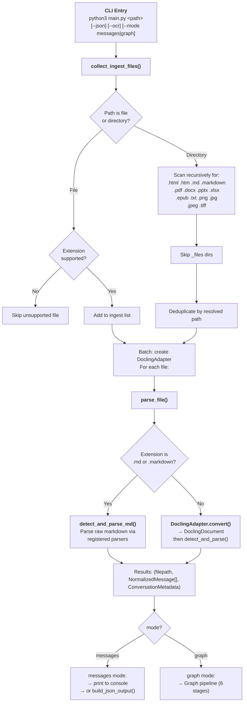
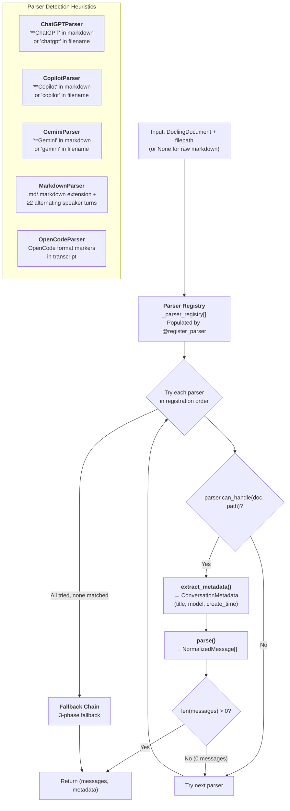
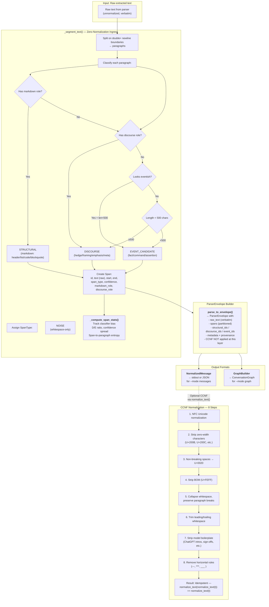
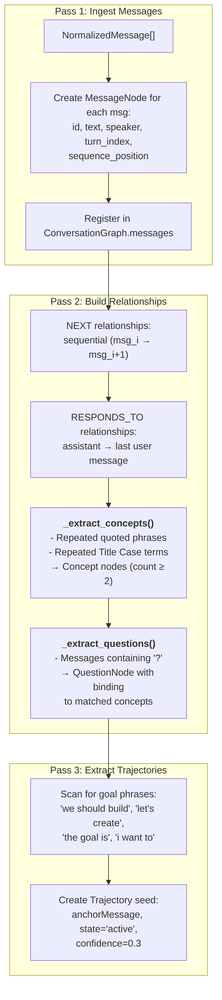
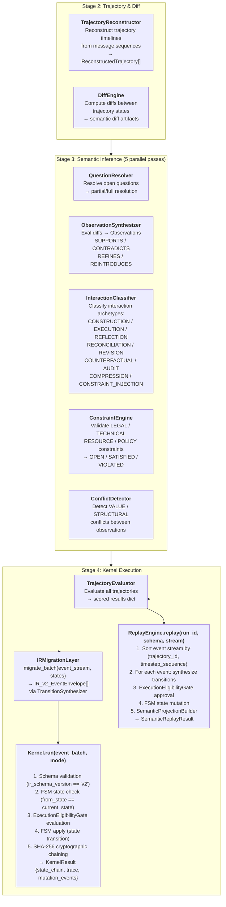
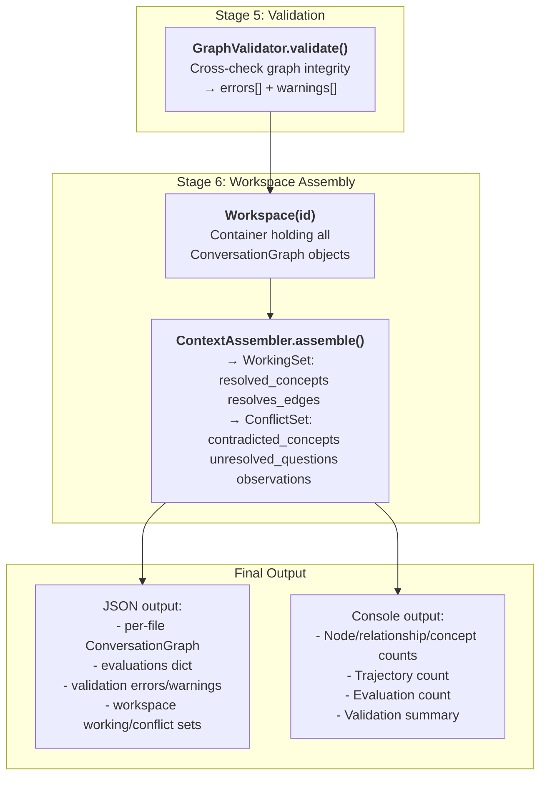
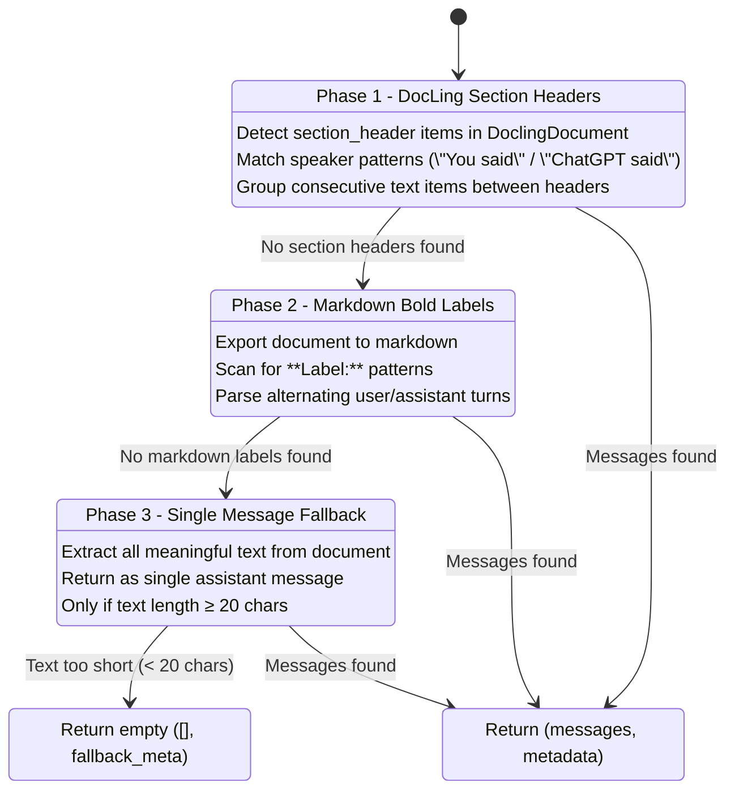
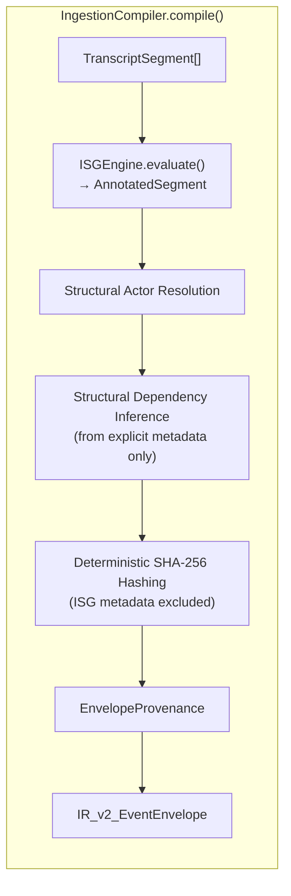

# Absorption & Ingestion Pipeline Flow

> **Version:** 0.1 (2026-06-28)
> **Scope:** `nexus/python/absorb/html/` — Document ingestion, chat transcript parsing, semantic graph construction, and deterministic kernel execution.
> **Entrypoint:** `main.py` via `python3 main.py <path> [--mode messages|graph] [--json]`

---

## Table of Contents

1. [Pipeline Architecture Overview](#1-pipeline-architecture-overview)
2. [File Discovery & Ingestion Flow](#2-file-discovery--ingestion-flow)
3. [DocLing Document Conversion Flow](#3-docling-document-conversion-flow)
4. [Parser Detection & Dispatch Flow](#4-parser-detection--dispatch-flow)
5. [Span Segmentation & Normalization Flow](#5-span-segmentation--normalization-flow)
6. [Graph Mode Pipeline (6 Stages)](#6-graph-mode-pipeline-6-stages)
7. [Fallback Chain Flow](#7-fallback-chain-flow)
8. [Key Data Structures](#8-key-data-structures)
9. [Design Properties](#9-design-properties)

---

## 1. Pipeline Architecture Overview

```mermaid
graph TB
    subgraph INPUT["Input Sources"]
        direction TB
        F1["<b>Source Files</b><br/>HTML / PDF / DOCX / PPTX<br/>EPUB / MD / Images / TXT"]
        F2["<b>File Discovery</b><br/>collect_ingest_files()<br/>Recursive directory scan<br/>22 supported extensions"]
    end

    subgraph CONVERSION["DocLing Conversion Layer"]
        direction TB
        ADAPTER["<b>DoclingAdapter</b><br/>convert(filepath)<br/>Unified document converter"]
        MD_EXPORT["export_to_markdown()"]
        TEXT_EXPORT["export_to_text()"]
    end

    subgraph PARSER["Parser Detection & Dispatch"]
        direction TB
        REGISTRY["<b>Parser Registry</b><br/>@register_parser decorators<br/>Auto-discovered on import"]
        DETECT["<b>detect_and_parse()</b><br/>Try each parser in order<br/>First match wins"]
        FALLBACK["<b>Fallback Chain</b><br/>3-phase fallback when no<br/>parser matches"]
    end

    subgraph PARSERS["Registered Parser Modules"]
        CP["<b>ChatGPTParser</b><br/>**ChatGPT label detection<br/>or filename contains 'chatgpt'"]
        CHTML["<b>ChatGPTHtmlParser</b><br/>Raw ChatGPT HTML parsing<br/>(without DocLing)"]
        COP["<b>CopilotParser</b><br/>**Copilot label detection"]
        GEM["<b>GeminiParser</b><br/>**Gemini label detection"]
        MD["<b>MarkdownParser</b><br/>Paragraph-level conversation<br/>pattern detection"]
        OC["<b>OpenCodeParser</b><br/>OpenCode format transcripts"]
    end

    subgraph NORMALIZE["Normalization Layer"]
        direction TB
        SEG["<b>Span Segmentation</b><br/>_segment_text() → Spans<br/>STRUCTURAL / DISCOURSE<br/>EVENT_CANDIDATE / NOISE"]
        CCNF["<b>CCNF Normalization</b><br/>normalize_text()<br/>8-step idempotent cleanup"]
        ENV["<b>ParserEnvelope</b><br/>Raw text + spans + metadata<br/>Zero normalization preserved"]
    end

    subgraph MSG_MODE["Messages Mode (--mode messages)"]
        OUTPUT_MSG["<b>Output</b><br/>NormalizedMessage[] +<br/>ConversationMetadata<br/>→ stdout or JSON file"]
    end

    subgraph GRAPH_MODE["Graph Mode (--mode graph)"]
        direction TB
        
        subgraph STAGE1["Stage 1: Graph Construction"]
            GB["<b>GraphBuilder</b><br/>3-pass construction<br/>Pass 1: Ingest messages<br/>Pass 2: Build relationships + concepts + questions<br/>Pass 3: Extract trajectory seeds"]
        end
        
        subgraph STAGE2["Stage 2: Trajectory & Diff Analysis"]
            TR["<b>TrajectoryReconstructor</b><br/>Reconstruct trajectory timelines<br/>from message sequences"]
            DE["<b>DiffEngine</b><br/>Compute semantic diffs<br/>between trajectory states"]
        end
        
        subgraph STAGE3["Stage 3: Semantic Inference"]
            QR["<b>QuestionResolver</b><br/>Resolve open questions<br/>against trajectory state"]
            OS["<b>ObservationSynthesizer</b><br/>Synthesize observations<br/>from trajectory diffs"]
            IC["<b>InteractionClassifier</b><br/>Classify interaction patterns<br/>(construction/execution/reflection/...)"]
            CE["<b>ConstraintEngine</b><br/>Validate constraints<br/>against trajectory states"]
            CD["<b>ConflictDetector</b><br/>Detect VALUE / STRUCTURAL<br/>conflicts between observations"]
        end
        
        subgraph STAGE4["Stage 4: Kernel Execution"]
            TE["<b>TrajectoryEvaluator</b><br/>Evaluate trajectories<br/>→ scored results"]
            IRM["<b>IRMigrationLayer</b><br/>Migrate event stream<br/>via TransitionSynthesizer"]
            KERNEL["<b>Kernel</b><br/>FSM Controller + ExecutionEligibilityGate<br/>5-step deterministic pipeline<br/>Cryptographic state chaining"]
            REPLAY["<b>ReplayEngine</b><br/>Deterministic replay<br/>Sorted event stream → FSM →<br/>SemanticProjection"]
        end
        
        subgraph STAGE5["Stage 5: Validation"]
            GV["<b>GraphValidator</b><br/>Validation: errors + warnings<br/>Cross-check graph integrity"]
        end
        
        subgraph STAGE6["Stage 6: Workspace Assembly"]
            CA["<b>ContextAssembler</b><br/>Assemble working_set +<br/>conflict_set from workspace"]
            WS["<b>Workspace</b><br/>Container for all conversation<br/>graphs and replay views"]
        end
    end

    INPUT --> CONVERSION
    CONVERSION --> PARSER
    PARSER --> PARSERS
    PARSERS --> NORMALIZE
    
    NORMALIZE --> MSG_MODE
    NORMALIZE --> GRAPH_MODE
    
    GRAPH_MODE --> STAGE1
    STAGE1 --> STAGE2
    STAGE2 --> STAGE3
    STAGE3 --> STAGE4
    STAGE4 --> STAGE5
    STAGE5 --> STAGE6
```



---

## 2. File Discovery & Ingestion Flow



---

## 3. DocLing Document Conversion Flow

```mermaid
graph TB
    subgraph ADAPTER["DoclingAdapter"]
        direction TB
        CONV["<b>convert(path)</b><br/>DocumentConverter.convert()"]
        CONV_ALL["<b>convert_all(paths)</b><br/>Batch with error isolation"]
        EXTRACT["<b>extract_text_items(doc)</b><br/>→ list of {text, label, prov}"]
        MD["<b>export_to_markdown(doc)</b><br/>→ Markdown string"]
        TXT["<b>get_text(doc)</b><br/>→ Plain text"]
        IMG["<b>extract_images(doc)</b><br/>→ list of image refs"]
    end

    subgraph SOURCES["Supported Source Formats"]
        HTML["HTML (ChatGPT export)"]
        PDF["PDF documents"]
        DOCX["Word documents"]
        PPTX["PowerPoint"]
        XLSX["Excel"]
        EPUB["EPUB ebooks"]
        IMG["Images (PNG/JPG/TIFF)<br/>with optional OCR"]
        TXT["Plain text"]
    end

    subgraph DOCLING["DoclingDocument"]
        DIRECTION TB
        TEXTS["<b>.texts</b><br/>List of text items with<br/>label, text, prov"]
        PICS["<b>.pictures</b><br/>List of image references"]
        MD2["<b>.export_to_markdown()</b><br/>Full markdown output"]
    end

    SOURCES --> CONV
    CONV --> DOCLING
    DOCLING --> EXTRACT
    DOCLING --> MD
    DOCLING --> TXT
    DOCLING --> IMG
    
    MD -->|"Input to"| PARSER["Parser Detection"]
    EXTRACT -->|"Optional"| PARSER
```

---

## 4. Parser Detection & Dispatch Flow



---

## 5. Span Segmentation & Normalization Flow



---

## 6. Graph Mode Pipeline (6 Stages)

### Stage 1: Graph Construction (3 Passes)



### Stage 2-3: Trajectory & Semantic Analysis



### Stages 5-6: Validation & Assembly



---

## 7. Fallback Chain Flow



---

## 8. Key Data Structures

### Span Types & Classification

| Type | Description | Markdown Roles | Discourse Roles | Event Extraction |
|------|-------------|----------------|-----------------|------------------|
| **STRUCTURAL** | Markdown structure | code_block, header, list_item, ordered_list_item, blockquote, horizontal_rule | — | No |
| **DISCOURSE** | Intent modulation | — | hedge, framing, emphasis, meta | No |
| **EVENT_CANDIDATE** | Fact/command/assertion | — | — | Yes — eligible for CCNF |
| **NOISE** | Whitespace/empty | — | — | No |

### Ingestion Compiler (Layer XII)



### ConversationGraph Entity Registry

| Registry | Type | Key | Purpose |
|----------|------|-----|---------|
| `messages` | MessageNode | message_id | Raw message text and speaker metadata |
| `concepts` | Concept | concept_id | Extracted key phrases (count ≥ 2) |
| `trajectories` | Trajectory | traj_id | Goal-seeded execution paths |
| `reconstructed_trajectories` | ReconstructedTrajectory | traj_id | Full timeline reconstruction |
| `questions` | QuestionNode | q_id | Open/resolved questions with concept bindings |
| `observations` | Observation | obs_id | SUPPORTS/CONTRADICTS/REFINES/REINTRODUCES |
| `constraints` | ConstraintNode | constraint_id | LEGAL/TECHNICAL/RESOURCE/POLICY |
| `interruptions` | Interruption | int_id | Speaker transition interruptions |
| `peos` | PEO | peo_id | Proposal/Execution/Observation artifacts |
| `relationships` | Relationship (list) | — | NEXT, RESPONDS_TO edges |
| `replay_views` | MaterializedReplayView | run_id→version | Deterministic replay outputs |
| `semantic_results` | SemanticReplayResult | run_id | Projection-based results |

### Kernel Execution State Chain

| Entry | Fields | Purpose |
|-------|--------|---------|
| `KernelResultStateEntry` | index, state_hash, prev_hash | Cryptographic state chain link |
| `KernelResultTraceEntry` | index, envelope_id, outcome, state_hash, policy_snapshot_id | Execution trace log |
| `GraphMutationEvent` | event_id, trajectory_id, timestep_seq, mutations[], provenance | Deterministic graph mutation with SHA-256 hash |
| `KernelResult` | run_id, status, state_chain[], trace[], determinism | Final kernel output |

### NexusVM Temporal DAG

| Component | Purpose |
|-----------|---------|
| **Timeline** | Linear execution path with parent, fork_index |
| **InstructionRecord** | GraphMutation + state_hash |
| **Snapshot** | Timeline_id + instruction_index → GraphState |
| **Fork** | New timeline from parent at specific instruction index |

---

## 9. Design Properties

| Property | Description |
|----------|-------------|
| **Zero-normalization ingress** | Spans are exact substrings of original text — never normalized |
| **Deterministic classification** | Span type assignment is rule-based, not ML-driven |
| **CCNF-late normalization** | normalize_text() only applied on output messages, not on spans |
| **Parser pluggability** | New parsers register via `@register_parser` decorator |
| **Multi-phase fallback** | 3 phases with increasing coarseness guarantee some output |
| **Idempotent normalization** | normalize_text(normalize_text(t)) == normalize_text(t) |
| **Cryptographic chaining** | Kernel uses SHA-256 hash chain over all state transitions |
| **All-or-nothing kernel** | Error on any envelope → HALTED_ON_ERROR, no partial commit |
| **Replayable via projection** | ReplayEngine produces SemanticReplayResult from sorted event stream |
| **Schema-gated** | Every kernel execution validates ir_schema_version == 'v2' |
| **Policy-controlled** | ExecutionEligibilityGate evaluates transitions against PolicySnapshot |
| **Temporal DAG** | NexusVM supports fork/merge timeline semantics |
