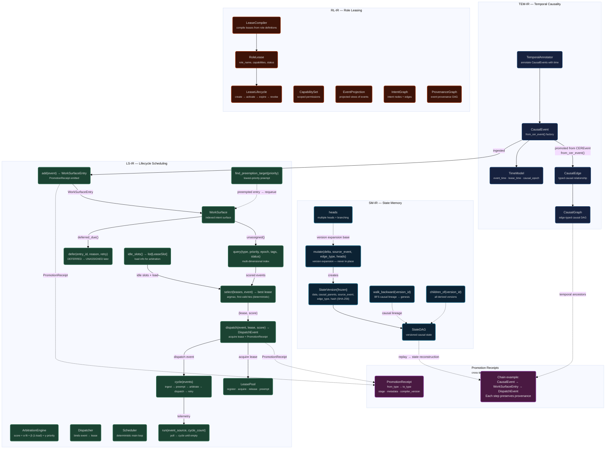
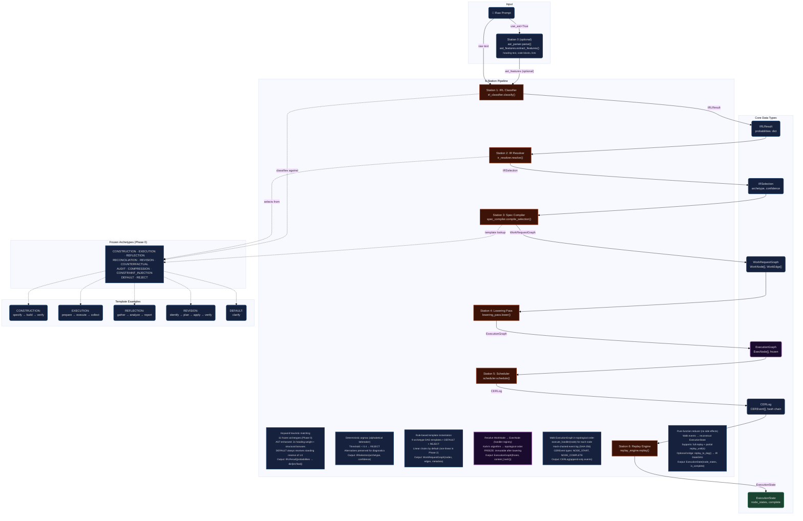
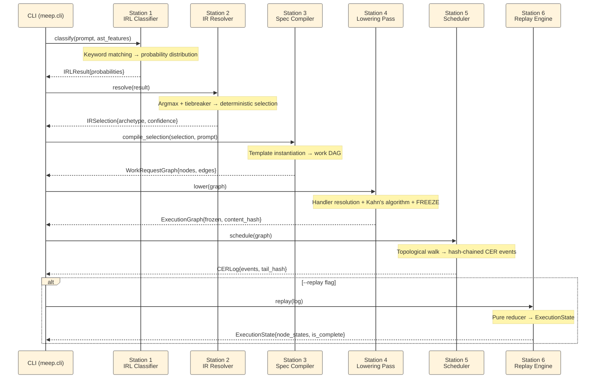
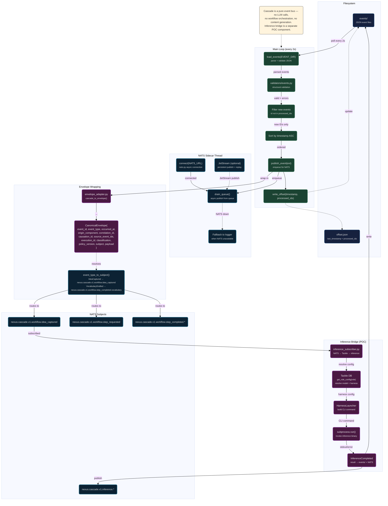

# Cognitive Runtime Flow

> Mermaid diagrams for the Python cognitive runtime pipeline:
> **NBK** (causal graph kernel) → **IR** (typed execution semantics) → **Cascade** (event bus) → **MEEP** (deterministic prompt→CER pipeline).

---

## 1. Architecture Overview

```mermaid
%%{init: {'theme': 'base', 'themeVariables': {
  'fontSize': '13px',
  'primaryBorderColor': '#555',
  'lineColor': '#666'
}}}%% 

graph TB
    %% ===== STYLES =====
    classDef nbk fill:#1a0a2e,stroke:#9b59b6,stroke-width:2px,color:#ddd
    classDef ir fill:#0c2233,stroke:#1a6b8a,stroke-width:2px,color:#ddd
    classDef cascade fill:#1b4332,stroke:#2d6a4f,stroke-width:2px,color:#ddd
    classDef meep fill:#3d1308,stroke:#8b2500,stroke-width:2px,color:#ddd
    classDef data fill:#16213e,stroke:#0f3460,stroke-width:2px,color:#ddd
    classDef external fill:#2d2d2d,stroke:#888,stroke-width:2px,color:#ccc

    %% ===== EXTERNAL INPUTS =====
    subgraph EXT["External Inputs"]
        PROMPT("📝 Raw Prompt<br/><small>Text from user / CLI</small>"):::external
        EVENTS_DIR("📂 events/ directory<br/><small>JSON event files on disk</small>"):::external
        NATS_IN("📡 NATS subjects<br/><small>nexus.cascade.v1.*</small>"):::external
    end

    %% ===== NBK LAYER =====
    subgraph NBK_LAYER["NBK — Nexus Bootstrap Kernel"]
        direction TB
        NBK_CORE("NexusBootstrapKernel<br/><small>Causal graph executor</small>"):::nbk
        NBK_P1("P1 · NODE<br/><small>pure transformation</small>"):::nbk
        NBK_P2("P2 · EDGE<br/><small>causal constraint</small>"):::nbk
        NBK_P3("P3 · TRACE<br/><small>replay substrate</small>"):::nbk
        NBK_P4("P4 · LEASE<br/><small>distributed execution</small>"):::nbk
        NBK_P5("P5 · ADDRESS<br/><small>CAL addressing</small>"):::nbk
        NBK_RULES("Mutation Rules<br/><small>CollapseChainRule<br/>MergeIdleLeasesRule</small>"):::nbk
        NBK_QUERY("SCQL Query<br/><small>predicate-based graph query</small>"):::nbk
    end

    %% ===== IR LAYER =====
    subgraph IR_LAYER["IR — Typed Execution Semantics<br/><small>4 sub-layers</small>"]
        direction TB

        subgraph SM_IR["SM-IR: State Memory"]
            DAG("StateDAG<br/><small>versioned causal state DAG</small>"):::ir
            SV("StateVersion<br/><small>immutable snapshots</small>"):::ir
            SVIEW("StateView<br/><small>read-optimized projections</small>"):::ir
            SREPLAY("StateReplayEngine<br/><small>replay events → StateDAG</small>"):::ir
        end

        subgraph TEM_IR["TEM-IR: Temporal Causality"]
            CE("CausalEvent<br/><small>promoted CEREvent</small>"):::ir
            CG("CausalGraph<br/><small>typed causal edges</small>"):::ir
            TM("TimeModel<br/><small>3-layer time (event, lease, epoch)</small>"):::ir
            TA("TemporalAnnotator<br/><small>annotates events with time</small>"):::ir
        end

        subgraph RL_IR["RL-IR: Role Leasing"]
            RL("RoleLease<br/><small>capability-gated lease</small>"):::ir
            EP("EventProjection<br/><small>projected event views</small>"):::ir
            IG("IntentGraph<br/><small>intent DAG</small>"):::ir
            LC("LeaseCompiler<br/><small>compile leases from roles</small>"):::ir
            PG("ProvenanceGraph<br/><small>event provenance DAG</small>"):::ir
        end

        subgraph LS_IR["LS-IR: Lifecycle Scheduling"]
            WS("WorkSurface<br/><small>indexed intent surface</small>"):::ir
            LP("LeasePool<br/><small>idle/active/preempt</small>"):::ir
            AE("ArbitrationEngine<br/><small>weighted scoring (α·fit + β·load + γ·pri)</small>"):::ir
            DISP("Dispatcher<br/><small>binds events → leases</small>"):::ir
            SCHED("Scheduler<br/><small>poll → arbitrate → dispatch loop</small>"):::ir
            PR("PromotionReceipt<br/><small>cross-layer promotion audit</small>"):::ir
        end
    end

    %% ===== CASCADE LAYER =====
    subgraph CASCADE_LAYER["Cascade — Pure Event Bus"]
        direction TB
        CASCADE_MAIN("main.py<br/><small>ingest → validate → publish loop</small>"):::cascade
        CASCADE_VALID("validators/events.py<br/><small>structural event validation</small>"):::cascade
        CASCADE_NATS("nats_publisher.py<br/><small>NATS sidecar + JetStream</small>"):::cascade
        CASCADE_ENV("envelope_adapter.py<br/><small>→ CanonicalEnvelope</small>"):::cascade
        CASCADE_INF("inference_subscriber.py<br/><small>NATS → Tackle inference bridge</small>"):::cascade
    end

    %% ===== MEEP LAYER =====
    subgraph MEEP_LAYER["MEEP — Minimal End-to-End Pipeline<br/><small>6-station deterministic pipeline</small>"]
        direction TB

        S1("Station 1: IRL Classifier<br/><small>keyword heuristic → probability distribution</small>"):::meep
        S2("Station 2: IR Resolver<br/><small>argmax → deterministic archetype</small>"):::meep
        S3("Station 3: Spec Compiler<br/><small>template → WorkRequestGraph (DAG)</small>"):::meep
        S4("Station 4: Lowering Pass<br/><small>freeze boundary → ExecutionGraph</small>"):::meep
        S5("Station 5: Scheduler<br/><small>topological walk → CER event log</small>"):::meep
        S6("Station 6: Replay Engine<br/><small>pure reducer → ExecutionState</small>"):::meep
    end

    %% ===== DATA STORES =====
    subgraph DATA["Data Stores"]
        EVENT_STORE("events/ directory<br/><small>JSON event files</small>"):::data
        CER_LOG("CER Event Log<br/><small>hash-chained append-only</small>"):::data
        NBK_SNAPSHOT("Kernel Snapshot<br/><small>serialisable state</small>"):::data
    end

    %% ===== CROSS-CUTTING =====
    subgraph SHARED["Shared Types"]
        CAL("CAL Address<br/><small>cal://realm/graph/traj/node/ver</small>"):::data
        PROMPT_IR("PromptIR<br/><small>structured prompt analysis</small>"):::data
        CONSTRAINTS("ConstraintSet<br/><small>system invariants</small>"):::data
    end

    %% ===== CONNECTIONS =====
    PROMPT -->|"python -m meep.cli"| S1
    S1 -->|"IRLResult (probabilities)"| S2
    S2 -->|"IRSelection (archetype)"| S3
    S3 -->|"WorkRequestGraph (mutable)"| S4
    S4 -->|"ExecutionGraph (frozen)"| S5
    S5 -->|"CERLog (append-only)"| S6
    S6 -->|"ExecutionState (reconstructed)"| PROMPT_IR

    S5 -.->|"events"| CER_LOG
    S6 -.->|"replay → StateDAG"| DAG

    %% IR internal flow
    CE -->|"promoted from CEREvent"| WS
    WS -->|"unassigned events"| AE
    AE -->|"scored leases"| DISP
    DISP -->|"DispatchEvent"| SCHED
    LP -.->|"idle leases"| AE
    LP -.->|"acquire/release"| DISP
    SCHED -->|"telemetry"| EP

    %% NBK flows
    NBK_CORE -->|"uses"| NBK_P1
    NBK_CORE -->|"uses"| NBK_P2
    NBK_CORE -->|"records"| NBK_P3
    NBK_CORE -->|"schedules"| NBK_P4
    NBK_CORE -->|"addresses"| NBK_P5
    NBK_CORE -->|"mutates via"| NBK_RULES
    NBK_CORE -->|"queries via"| NBK_QUERY
    NBK_CORE --> NBK_SNAPSHOT

    %% NBK → IR bridge
    NBK_CORE -.->|"edges → CausalEdge"| CG
    NBK_CORE -.->|"traces → replay"| SREPLAY

    %% Cascade flows
    EVENTS_DIR -->|"poll every 2s"| CASCADE_MAIN
    CASCADE_MAIN -->|"validated events"| CASCADE_VALID
    CASCADE_MAIN -->|"publish"| CASCADE_NATS
    CASCADE_NATS -->|"CanonicalEnvelope"| CASCADE_ENV
    CASCADE_MAIN -.->|"write offset"| EVENT_STORE
    NATS_IN -->|"subscribe"| CASCADE_INF
    CASCADE_INF -->|"InferenceCompleted"| CASCADE_NATS

    %% MEEP → IR bridge
    S6 -.->|"replay_to_dag()"| SREPLAY
    S5 -.->|"CEREvent → CausalEvent.from_cer_event()"| CE
```



---

## 2. NBK — Causal Graph Execution Flow

```mermaid
%%{init: {'theme': 'base', 'themeVariables': {
  'fontSize': '13px',
  'primaryBorderColor': '#555'
}}}%%

graph TB
    %% ===== STYLES =====
    classDef graph fill:#1a0a2e,stroke:#9b59b6,stroke-width:2px,color:#ddd
    classDef exec fill:#0c2233,stroke:#1a6b8a,stroke-width:2px,color:#ddd
    classDef trace fill:#1b4332,stroke:#2d6a4f,stroke-width:2px,color:#ddd
    classDef lease fill:#3d1308,stroke:#8b2500,stroke-width:2px,color:#ddd
    classDef query fill:#16213e,stroke:#0f3460,stroke-width:2px,color:#ddd
    classDef rules fill:#4a1942,stroke:#7b2d8e,stroke-width:2px,color:#eee
    classDef cli fill:#2d2d2d,stroke:#888,stroke-width:2px,color:#ccc

    subgraph BUILD["Graph Construction"]
        ADD_NODE("add_node(id, fn, **metadata)<br/><small>registers computation node</small>"):::graph
        ADD_EDGE("add_edge(from_id, to_id)<br/><small>causal dependency (cycle-checked)</small>"):::graph
        NODES("NodeDef{id, fn, metadata}"):::graph
        EDGES("Edge{from_id, to_id}"):::graph
        CYCLE("Cycle detection (BFS)<br/><small>would_cycle() safeguards</small>"):::graph
    end

    subgraph EXECUTION["Execution Engine"]
        SCHED_LEASE("schedule_leases(executors, strategy)<br/><small>round_robin or first-available</small>"):::exec
        READY("ready_nodes()<br/><small>deps met + lease valid + not yet computed</small>"):::exec
        RESOLVE("resolve_inputs(node_id)<br/><small>gather upstream outputs</small>"):::exec
        EXEC("execute_ready_nodes()<br/><small>topological tick → sorted(batch)</small>"):::exec
        EXEC_ONE("_execute_one(node_id)<br/><small>nd.fn(inputs) → output stored</small>"):::exec
    end

    subgraph TRACE_LOG["Trace Log"]
        TRACE("Trace{sequence, node_id, input_state, output_state, timestamp}"):::trace
        REPLAY("replay()<br/><small>walk traces in order → reconstruct state</small>"):::trace
        SNAPSHOT("snapshot()<br/><small>serialisable: nodes, edges, states, traces, leases</small>"):::trace
        RESET("reset()<br/><small>clear state, preserve graph structure</small>"):::trace
    end

    subgraph LEASES["Lease Management"]
        LEASE("Lease{node_id, executor_id, issued_at}"):::lease
        L_SCHED("schedule_leases()<br/><small>assign all unleased nodes</small>"):::lease
        L_ADD("add_lease(node_id, executor_id)<br/><small>manual binding</small>"):::lease
        L_VALID("lease_valid(node_id)<br/><small>check binding exists</small>"):::lease
    end

    subgraph QUERY["SCQL Query"]
        SCQL("query(predicate)<br/><small>filter by node_id, state, lease, deps</small>"):::query
        SCQL_EXAMPLE("Nodes with large state<br/>Nodes by lease assignment<br/>Uncomputed nodes"):::query
    end

    subgraph MUTATION["Self-Modification (SOCO)"]
        MUTATE("mutate(rule)<br/><small>apply rule → affected node list</small>"):::rules
        COLLAPSE("CollapseChainRule<br/><small>fuse A→B→C into single node</small>"):::rules
        MERGE("MergeIdleLeasesRule<br/><small>consolidate idle leases</small>"):::rules
    end

    subgraph CLI["CLI Entrypoints"]
        CLI_RUN("nbk run<br/><small>execute ETL pipeline example</small>"):::cli
        CLI_INFO("nbk info<br/><small>graph structure + dependencies</small>"):::cli
        CLI_DOT("nbk dot<br/><small>DOT graph for visualization</small>"):::cli
        CLI_SCQL("nbk scql<br/><small>predicate queries on state</small>"):::cli
    end

    subgraph ADDRESS["CAL Addressing"]
        CAL_ADDR("make_address(realm, graph, trajectory, node_id, version)<br/><small>cal://realm/graph/traj/node/ver</small>"):::query
        PARSE("parse_address(address)<br/><small>→ {realm, graph, trajectory, node_id, version}</small>"):::query
        ADDR_OF("address_of(node_id)<br/><small>cal://dev/example-etl/t0/extract/hash</small>"):::query
    end

    %% Flow edges
    ADD_NODE --> NODES
    ADD_EDGE --> EDGES
    ADD_EDGE -.-> CYCLE
    NODES --> SCHED_LEASE
    EDGES --> READY
    NODES --> READY
    SCHED_LEASE --> LEASE
    LEASE --> L_VALID
    L_VALID --> READY
    READY --> EXEC
    EXEC --> EXEC_ONE
    EXEC_ONE --> TRACE
    EXEC_ONE --> RESOLVE
    RESOLVE -.->|"upstream states"| NODES

    TRACE --> REPLAY
    TRACE --> SNAPSHOT
    SNAPSHOT -.->|"serialisable dict"| CLI_INFO

    EXEC --> SCQL
    SCQL --> SCQL_EXAMPLE

    EXEC --> MUTATE
    MUTATE --> COLLAPSE
    MUTATE --> MERGE

    CLI_RUN --> ADD_NODE
    CLI_RUN --> ADD_EDGE
    CLI_RUN --> EXEC

    CAL_ADDR --> PARSE
    PARSE --> ADDR_OF
    ADDR_OF -.-> NODES
```

---

## 3. IR — State & Scheduling Flow



---

## 4. MEEP — 6-Station Pipeline Detail



### Execution Sequence



---

## 5. Cascade — Event Bus Flow



---

## 6. Cross-Module Integration Matrix

| Module | Provides | Consumes | Entrypoint | Key Types |
|--------|----------|----------|------------|-----------|
| **NBK** | Causal graph execution, self-modification (SOCO), SCQL query, CAL addressing | User-defined node functions and graph topology | `cli.py` | `NexusBootstrapKernel`, `NodeDef`, `Edge`, `Trace`, `Lease`, `MutationRule` |
| **IR** | StateDAG (versioned causal state), CausalEvent (temporal), RoleLease (capability-gated), WorkSurface (intent queue), Arbitration (weighted scoring), Scheduler (deterministic loop) | Events from MEEP (CEREvent → CausalEvent), edges from NBK (Edge → CausalEdge) | — (library) | `StateDAG`, `StateVersion`, `CausalEvent`, `CausalEdge`, `RoleLease`, `WorkSurface`, `LeasePool`, `ArbitrationEngine`, `Dispatcher`, `Scheduler`, `PromotionReceipt` |
| **Cascade** | Pure event bus (ingest → validate → publish), NATS JetStream sidecar, CanonicalEnvelope wrapping, Inference bridge (POC) | `events/` directory (JSON files), NATS subjects | `main.py` | `CanonicalEnvelope`, `WorkSurfaceEntry` (via bridge) |
| **MEEP** | Deterministic prompt → CER pipeline (6 stations), Frozen archetype system (Phase 0), Hash-chained event log, Pure-function replay | Raw text prompt (CLI or stdin) | `cli.py` | `IRLResult`, `IRSelection`, `WorkRequestGraph`, `ExecutionGraph`, `CERLog`/`CEREvent`, `ExecutionState` |

### Key Integration Points

```
MEEP ────CEREvent────▶ IR
  │                    │
  │  CERLog            │ CausalEvent.from_cer_event()
  │  replay_to_dag()   │ StateReplayEngine.replay()
  │                    ▼
  └────────────▶ StateDAG (versioned causal state)
                          │
                          │ WorkSurface.add()
                          ▼
                    DispatchEvent → Scheduler cycle

NBK ────Edge────▶ IR
  │                │
  │                │ CausalEdge.from_nbk_edge()
  │                ▼
  │          CausalGraph
  │
  │   snapshot() ──▶ Replay via IR StateReplayEngine
```

---

## 7. Key Design Properties

| Property | NBK | IR | Cascade | MEEP |
|----------|-----|----|---------|------|
| **Paradigm** | Causal graph interpreter | Typed execution semantics | Pure event bus | Deterministic pipeline |
| **State Model** | Dict-of-nodes (latest output per node) | Versioned causal DAG (no in-place mutation) | Offset-tracked file polling | Hash-chained append-only log |
| **Mutation** | Self-modifying (SOCO rules) | Version expansion only | Append-only events | Freeze boundary (never mutate after lower) |
| **Determinism** | Sorted batch execution order | Argmax tiebreaker, sorted queries | Sorted by timestamp | Argmax, sorted topology, fixed-clock |
| **Idempotent** | Replay from traces | Same delta + parents = same hash | Offset dedup by event ID | Same prompt → same execution |
| **Error Model** | ValueError on cycles/duplicates | ValueError on invalid parents | Validation errors logged | FrozenGraphError on mutation |
| **Integration** | CAL addressing → IR causal edges | PromotionReceipt chain across all layers | NATS envelope → MEEP CausalEvent | replay_to_dag() → IR StateDAG |

---

*Sources: `python/nbk/`, `python/ir/`, `python/cascade/`, `python/meep/`, ARCHITECTURE.md Section V.*
