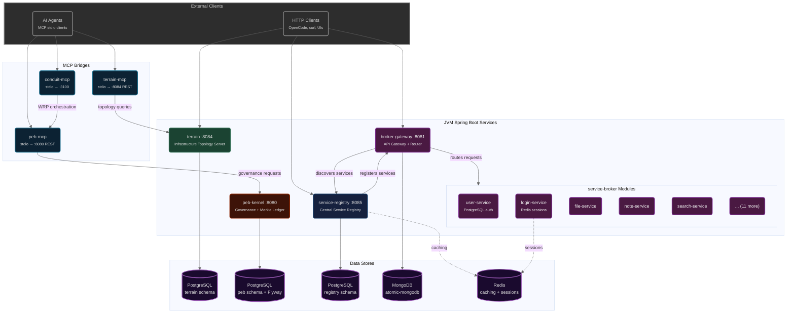
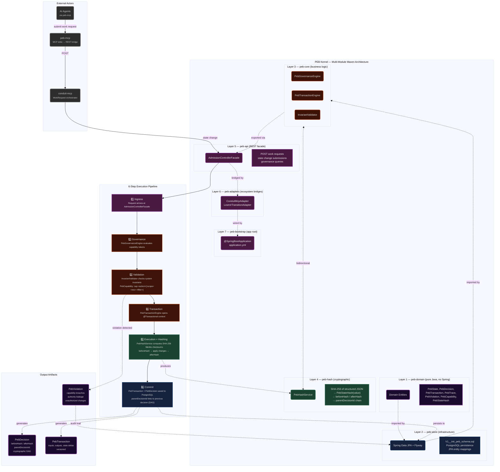
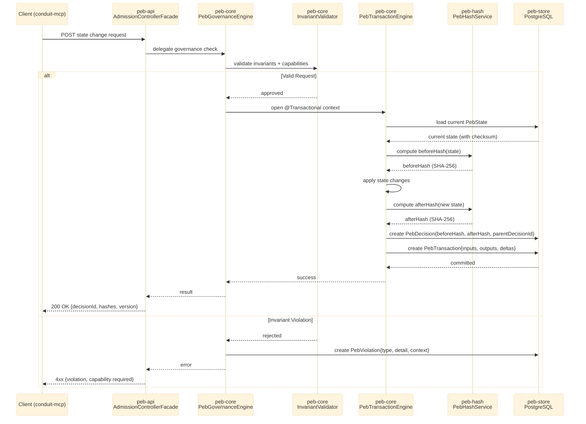
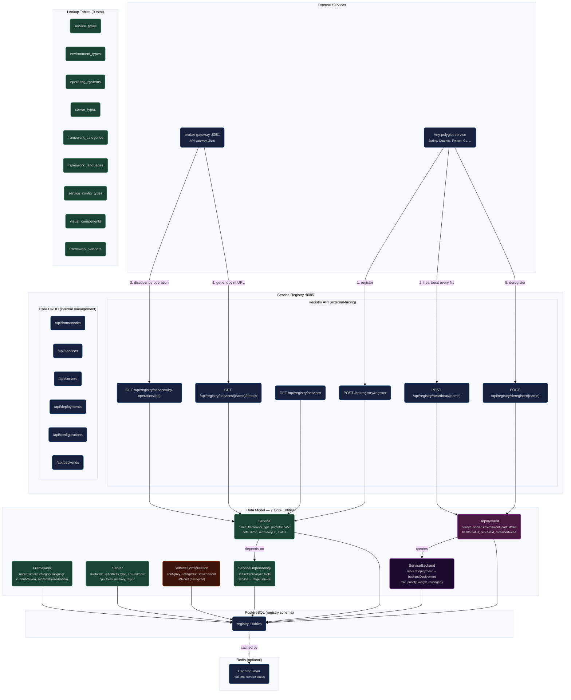
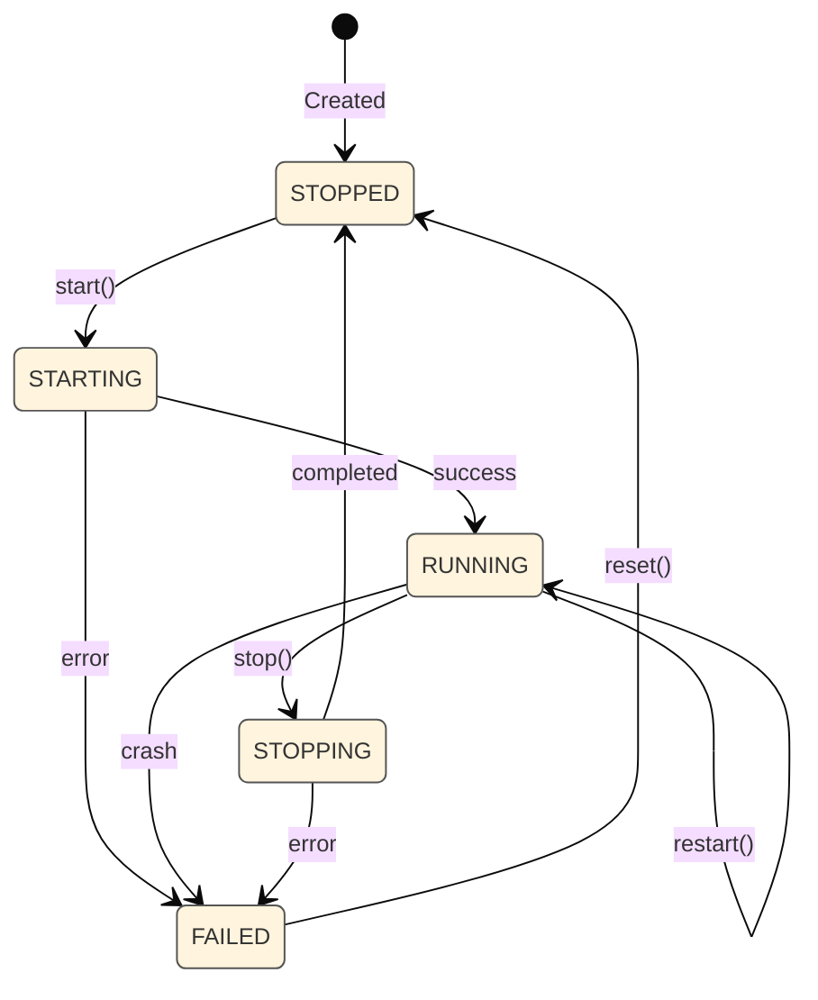
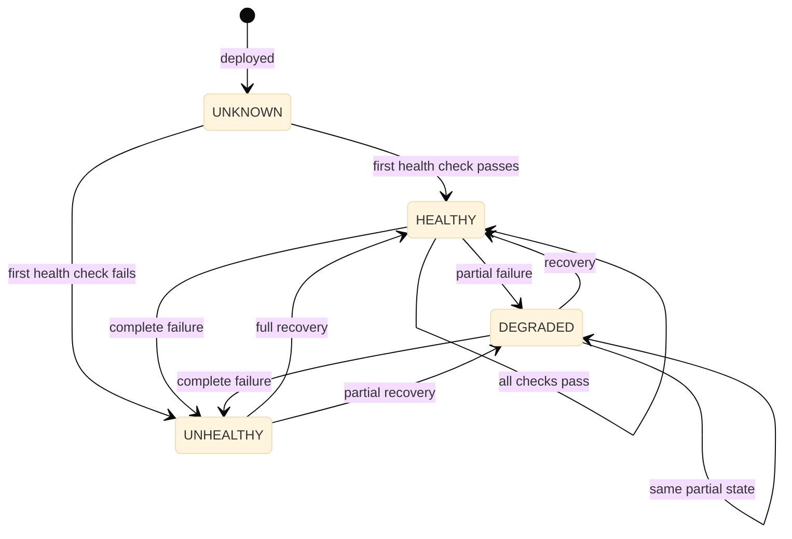
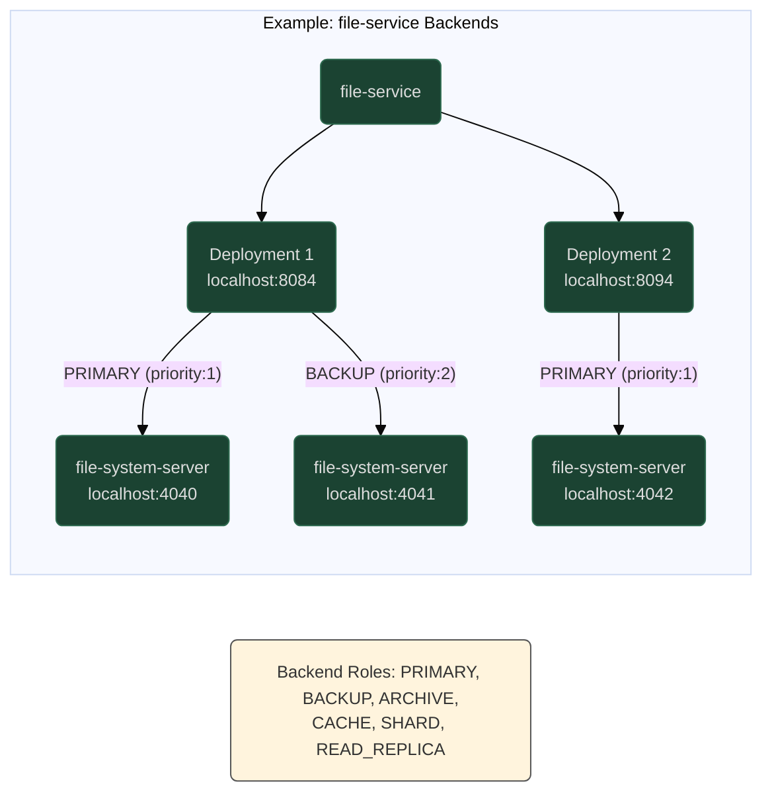
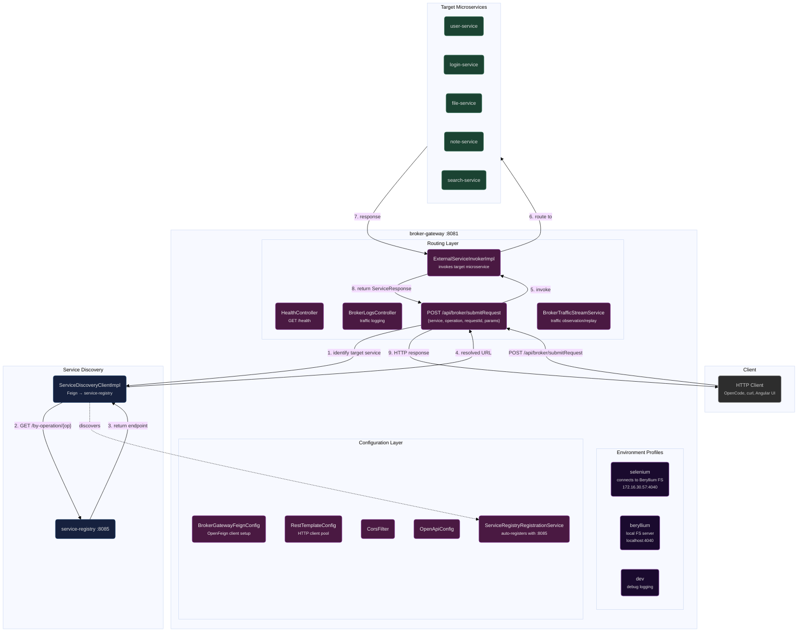
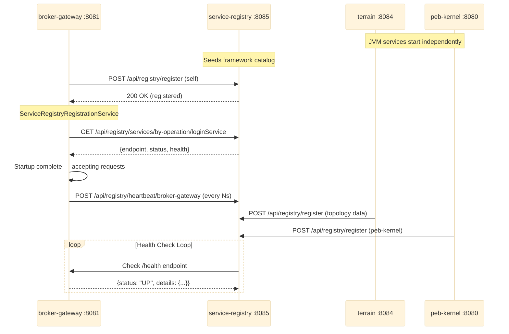

# JVM Service Pipeline Flows

> Data flow, execution pipeline, and lifecycle diagrams for the JVM Spring Boot ecosystem:
> terrain (:8084), peb-kernel (:8080), broker-gateway (:8081), service-registry (:8085).

---

## 1. Architecture Overview



---

## 2. terrain — Infrastructure Topology Flow

```mermaid
%%{init: {'theme': 'base', 'themeVariables': {
  'fontSize': '13px',
  'primaryBorderColor': '#555'
}}}%%

graph TB
    %% ===== STYLES =====
    classDef controller fill:#1b4332,stroke:#2d6a4f,stroke-width:2px,color:#ddd
    classDef entity fill:#16213e,stroke:#0f3460,stroke-width:2px,color:#ddd
    classDef data fill:#1a0a2e,stroke:#9b59b6,stroke-width:2px,color:#ddd
    classDef init fill:#3d1308,stroke:#8b2500,stroke-width:2px,color:#ddd
    classDef mcp fill:#0c2233,stroke:#1a6b8a,stroke-width:2px,color:#ddd

    subgraph INGRESS["Ingress Layer"]
        REST("REST API (:8084)<br/><small>Spring Boot 3.5.0</small>"):::controller
        TMCP("terrain-mcp<br/><small>MCP stdio bridge</small>"):::mcp
    end

    subgraph CONTROLLERS["Controller Layer (8 REST endpoints)"]
        direction TB
        MC("McpServerController<br/><small>/api/v1/mcp-servers</small>"):::controller
        RC("RunnableServiceController<br/><small>/api/v1/runnable-services</small>"):::controller
        SC("ServerController<br/><small>/api/v1/servers</small>"):::controller
        STC("ServiceTypeController<br/><small>/api/v1/service-types</small>"):::controller
        SDC("ServiceDependencyController<br/><small>/api/v1/service-dependencies</small>"):::controller
        CTC("CliToolController<br/><small>/api/v1/cli-tools</small>"):::controller
        BPC("BrokerProfileController<br/><small>/api/v1/broker-profiles</small>"):::controller
        RPC("RegistryServerProfileController<br/><small>/api/v1/registry-server-profiles</small>"):::controller
    end

    subgraph ENTITIES["Entity Layer (7 entities + polymorphic FK)"]
        direction TB
        MCP_E("McpServer<br/><small>port, transportType, workspacePath<br/>healthCheckUrl, version, status</small>"):::entity
        RS("RunnableService<br/><small>port, workspacePath, healthCheckUrl<br/>serviceTypeId, status</small>"):::entity
        SERV("Server<br/><small>hostname, ipAddress, os, status</small>"):::entity
        ST("ServiceType<br/><small>lookup: MCP, Microservice, etc.</small>"):::entity
        SD("ServiceDependency<br/><small>sourceType+sourceId → targetType+targetId<br/>criticality (REQUIRED/OPTIONAL)</small>"):::entity
        BP("BrokerProfile<br/><small>profileId, brokerUrl, imageUrl, autoConnect</small>"):::entity
        RP("RegistryServerProfile<br/><small>profileId, registryServerUrl, isActive</small>"):::entity
    end

    subgraph SEEDING["Startup Seeding (first run only)"]
        INIT("TopologyDataInitializer<br/><small>CommandLineRunner</small>"):::init
        CFG("JSON config files<br/><small>broker-profiles.json<br/>registry-server-profiles.json</small>"):::init
        CHECK("Check if records exist<br/><small>skip if not empty (idempotent)</small>"):::init
    end

    subgraph PG["PostgreSQL (terrain schema)"]
        TBL1["terrain.mcp_servers"]:::data
        TBL2["terrain.runnable_services"]:::data
        TBL3["terrain.servers"]:::data
        TBL4["terrain.service_types"]:::data
        TBL5["terrain.service_dependencies"]:::data
        TBL6["terrain.broker_profiles"]:::data
        TBL7["terrain.registry_server_profiles"]:::data
    end

    %% DATA FLOW
    TMCP -->|"tool calls"| REST
    REST -->|"dispatches to"| CONTROLLERS

    MC -->|"CRUD"| MCP_E
    RC -->|"CRUD"| RS
    SC -->|"CRUD"| SERV
    STC -->|"CRUD"| ST
    SDC -->|"CRUD"| SD
    CTC -->|"CRUD"| MCP_E
    BPC -->|"CRUD"| BP
    RPC -->|"CRUD"| RP

    MCP_E --> TBL1
    RS --> TBL2
    SERV --> TBL3
    ST --> TBL4
    SD --> TBL5
    BP --> TBL6
    RP --> TBL7

    INIT -->|"reads"| CFG
    INIT -->|"if empty"| CHECK
    CHECK -->|"inserts defaults"| BP
    CHECK -->|"inserts defaults"| RP

    NOTE("Seeding is idempotent: only runs on<br/>fresh databases. Hibernate ddl-auto=update<br/>auto-creates tables on first connect."):::init
    CHECK -.->|"(idempotent)"| NOTE
```



**API Surface:** All endpoints return `PagedResponse<T>` (paginated, sorted).

| Entity | GET List | GET By ID | POST | PUT | DELETE |
|--------|----------|-----------|------|-----|--------|
| McpServer | `/api/v1/mcp-servers` | `/{id}` | ✓ | ✓ | ✓ |
| RunnableService | `/api/v1/runnable-services` | `/{id}` | ✓ | ✓ | ✓ |
| Server | `/api/v1/servers` | `/{id}` | ✓ | ✓ | ✓ |
| ServiceType | `/api/v1/service-types` | `/{id}` | ✓ | ✓ | ✓ |
| ServiceDependency | `/api/v1/service-dependencies` | `/{id}` | ✓ | ✓ | ✓ |
| BrokerProfile | `/api/v1/broker-profiles` | `/{id}` | ✓ | ✓ | ✓ |
| RegistryServerProfile | `/api/v1/registry-server-profiles` | `/{id}` | ✓ | ✓ | ✓ |

---

## 3. peb-kernel — Governance Execution Flow



### Merkle Chain Detail



---

## 4. service-registry — Service Lifecycle



### Deployment Status Lifecycle



### Health Status Flow



### Backend Connection Graph



---

## 5. broker-gateway — Request Routing Flow



### Request Format

```json
{
  "service": "loginService",
  "operation": "login",
  "requestId": "unique-id",
  "params": {
    "alias": "username",
    "identifier": "password"
  }
}
```

### Startup Sequence



---

## 6. Key Data Structures

### terrain — ServiceDependency (Polymorphic)

```
sourceType:   "McpServer" | "RunnableService" | "Server"
sourceId:     BIGINT (FK to respective table)
targetType:   "McpServer" | "RunnableService" | "Server"
targetId:     BIGINT (FK to respective table)
criticality:  "REQUIRED" | "OPTIONAL" | ...
description:  TEXT
```

### peb-kernel — PebDecision (Merkle Chain)

```
id:               BIGSERIAL
decisionId:       UUID
parentDecisionId: UUID (FK → peb_decision, null for genesis)
beforeHash:       VARCHAR(64) (SHA-256 of state before change)
afterHash:        VARCHAR(64) (SHA-256 of state after change)
changeType:       VARCHAR (state_mutation, invariant_check, governance)
capabilityToken:  VARCHAR (e.g., "cap:mutate_state:key=invariants")
actor:            VARCHAR (who requested this change)
payload:          JSONB (the actual state delta)
createdAt:        TIMESTAMPTZ
```

### service-registry — Deployment Status Flow

```
Status:    STOPPED → STARTING → RUNNING → STOPPING → STOPPED
                                                → FAILED
Health:    UNKNOWN → HEALTHY → DEGRADED → UNHEALTHY
```

### broker-gateway — ServiceRequest

```
{
  "service":    String,    // Target service name
  "operation":  String,    // Operation to execute
  "requestId":  String,    // Unique request identifier
  "params":     Object     // Operation parameters
}
```

---

*Sources: `jvm/spring/terrain/src/`, `jvm/spring/peb-kernel/`, `jvm/spring/service-broker/broker-gateway/src/`, `jvm/spring/service-registry/`, ARCHITECTURE.md.*
