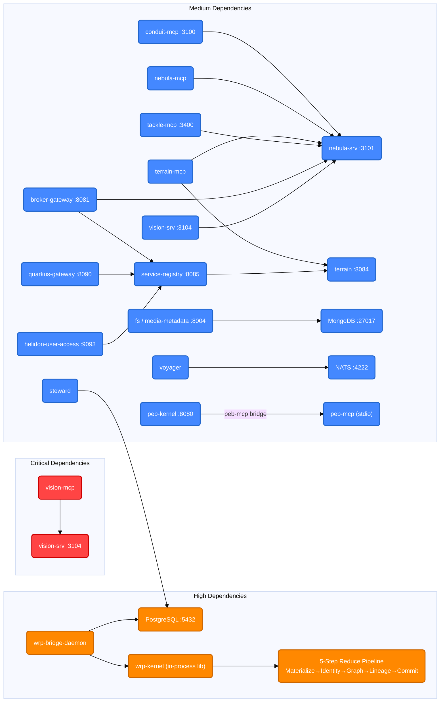

# Nexus Service Topology Diagram

## Architecture Overview

```mermaid
%%{init: {'theme': 'base', 'themeVariables': {
  'fontSize': '13px',
  'primaryBorderColor': '#555',
  'lineColor': '#666'
}}}%%

graph TB
    %% ===== STYLES =====
    classDef agentLayer fill:#1a1a2e,stroke:#e94560,stroke-width:2px,color:#eee
    classDef mcpLayer fill:#16213e,stroke:#0f3460,stroke-width:2px,color:#ddd
    classDef restLayer fill:#1b4332,stroke:#2d6a4f,stroke-width:2px,color:#ddd
    classDef uiLayer fill:#4a1942,stroke:#7b2d8e,stroke-width:2px,color:#eee
    classDef jvmLayer fill:#3d1308,stroke:#8b2500,stroke-width:2px,color:#ddd
    classDef pythonLayer fill:#0c2233,stroke:#1a6b8a,stroke-width:2px,color:#ddd
    classDef wrpLayer fill:#1a0a2e,stroke:#9b59b6,stroke-width:2px,color:#ddd
    classDef infraLayer fill:#2d2d2d,stroke:#666,stroke-width:2px,color:#ccc

    classDef critical fill:#ff4444,color:#fff,stroke:#cc0000,stroke-width:2px
    classDef high fill:#ff8800,color:#fff,stroke:#cc6600,stroke-width:2px
    classDef medium fill:#4488ff,color:#fff,stroke:#2266cc,stroke-width:2px
    classDef implicit fill:#888,color:#fff,stroke:#666,stroke-dasharray: 5 5

    %% ===== EDGE STYLES =====
    linkStyle default stroke-width:1px,fill:none

    %% ===== AI AGENT LAYER =====
    subgraph AA["AI Agent Layer"]
        AGENTS("AI Agents<br/><small>Codebuff / Claude / OpenCode</small>")
    end

    %% ===== MCP SERVER LAYER =====
    subgraph MCP["MCP Server Layer<br/><small>Model Context Protocol — stdio transport (except where noted)</small>"]
        CM["conduit-mcp<br/><small>:3100 • WorkRequest orchestrator</small>"]
        NM["nebula-mcp<br/><small>stdio→:3101 • Nebula RMS facade</small>"]
        KM["knowledge-mcp<br/><small>stdio • Graph explorer + semantic search</small>"]
        TM["terrain-mcp<br/><small>stdio • Topology read/write</small>"]
        TKM["tackle-mcp<br/><small>:3400 • AI config registry</small>"]
        PM["peb-mcp<br/><small>stdio • PEB Spring Boot facade</small>"]
        VM["vision-mcp<br/><small>stdio • Vision LOSM → :3104</small>"]
    end

    %% ===== REST API LAYER =====
    subgraph REST["REST API Layer"]
        NS["nebula-srv<br/><small>Express :3101</small>"]
        VS["vision-srv<br/><small>Express :3104</small>"]
        FSS["file-system-server<br/><small>Node.js :4040 • port externally configured</small>"]
        IS["image-server<br/><small>:9081</small>"]
        FS["fs / media-metadata<br/><small>FastAPI :8004 • Media indexing</small>"]
    end

    %% ===== FRONTEND UI LAYER =====
    subgraph UI["Frontend UI Layer"]
        NUI["nebula-ui<br/><small>Angular :3000</small>"]
        PUI["plurality-ui<br/><small>React :3001</small>"]
        DUI["duality-ui<br/><small>React :3002</small>"]
        NC["nexus-console<br/><small>Angular :4200</small>"]
        CUI["conduit-ui<br/><small>Angular :4201</small>"]
    end

    %% ===== JVM BACKEND LAYER =====
    subgraph JVM["JVM Backend Layer"]
        TERR["terrain<br/><small>Spring Boot :8084 • Topology registry</small>"]
        PK["peb-kernel<br/><small>Spring Boot :8080 • Governance + Merkle</small>"]
        BG["broker-gateway (service-broker)<br/><small>Spring Boot :8081 • API routing</small>"]
        SR["service-registry<br/><small>Spring Boot :8085 • Discovery</small>"]
        SBM["service-broker modules<br/><small>17 sub-modules</small>"]
        QG["quarkus-gateway<br/><small>Quarkus :8090 • Broker API</small>"]
        HUS["helidon-user-access<br/><small>Helidon MP :9093 • User auth</small>"]
    end

    %% ===== WRP PIPELINE LAYER (Python layer: bridge daemon + in-process kernel library) =====
    subgraph WRPI["WRP Pipeline — Bridge Daemon + Kernel Runtime"]
        WBD["🐉 wrp-bridge-daemon<br/><small>Polls vision.receipts (PG)<br/>Calls KernelEngine.reduce(delta) in-process</small>"]
        WK_INT["⚙️ wrp-kernel (in-process lib)<br/><small>python/conduit/wrp_kernel/</small>"]
        subgraph WK_STEPS["Kernel Reduce Pipeline (5-step)"]
            S1["1️⃣ Receipt Materialization<br/><small>Insert receipts, dedup check</small>"]
            S2["2️⃣ Identity Resolution<br/><small>node_id → identity_id mapping</small>"]
            S3["3️⃣ Graph Update<br/><small>Build GraphEdges (deps, impacts)</small>"]
            S4["4️⃣ Lineage Recording<br/><small>Trace every reduce step</small>"]
            S5["5️⃣ Commit<br/><small>Increment version, persist state</small>"]
        end
        subgraph WRP_STATES["WRP State Machine (Adjacency Matrix)"]
            direction LR
            CR["CREATED"] --> IN["INTAKE"]
            IN --> PL["PLANNING"]
            PL --> CRIT["CRITIQUE"]
            CRIT --> PL
            CRIT --> SP["SPECIFICATION"]
            SP --> AP["APPROVED"]
            AP --> QU["QUEUED"]
            QU --> EX["EXECUTING"]
            EX --> CO["COMPLETED"]
            CO --> AR["ARCHIVED"]
            ANY["Any state"] --> FA["FAILED"]
        end
    end

    %% ===== PYTHON LAYER =====
    subgraph PY["Python Layer"]
        NBK["nbk<br/><small>Cognitive runtime</small>"]
        IR["ir<br/><small>StateDAG + CausalGraph</small>"]
        CAS["cascade<br/><small>Event pipeline</small>"]
        CDT["conduit<br/><small>WRP orchestrator</small>"]
        VSPY["vision-srv-py<br/><small>FastAPI :8003</small>"]
        ACT["agent-chat (tackle)<br/><small>:3017 • Message box SSE</small>"]
        RVR["rover<br/><small>Harvest pipeline</small>"]
        SWD["steward<br/><small>Knowledge Graph Migration<br/>JSON → knowledge.graph_*</small>"]
        VYG["voyager<br/><small>Filesystem Acquisition Layer<br/>Scanner + TopologyEngine → NATS</small>"]
    end

    %% ===== INFRASTRUCTURE LAYER =====
    subgraph INFRA["Infrastructure Layer"]
        PG[("PostgreSQL<br/><small>:5432 • pgvector</small>")]
        MONGO[("MongoDB<br/><small>:27017</small>")]
        NATS{{"NATS<br/><small>:4222 • Message Bus</small>"}}
        REDIS[("Redis<br/><small>:6379 • Cache</small>")]
        OLLAMA{{"Ollama<br/><small>:11434 • LLM</small>"}}
    end

    %% ===== LAYER CONNECTIONS (AI Agents → MCP Servers) =====
    AGENTS === CM
    AGENTS === NM
    AGENTS === KM
    AGENTS === TM
    AGENTS === TKM
    AGENTS === PM
    AGENTS === VM

    %% ===== MCP → REST / SPRING PROXIES =====
    VM -- "MCP proxy (critical)" --> VS
    NM -- "MCP→REST proxy" --> NS
    TM -- "topology queries (medium)" --> TERR

    %% ===== SERVICE DEPENDENCIES (from terrain.service_dependencies) =====
    CM -- "depends (medium)" --> NS
    NM -- "depends (medium)" --> NS
    TM -- "depends (medium)" --> NS
    TKM -- "depends (medium)" --> NS
    BG -- "depends (medium)" --> NS
    VS -- "depends (medium)" --> NS

    %% ===== JVM INTERNAL DEPENDENCIES =====
    PK -- "governed by peb-mcp" --> PM
    BG -- "discovers via" --> SR
    SR -- "topology from" --> TERR
    QG -- "alternative runtime" -.-> BG
    HUS -- "auth for" -.-> BG
    SBM -- "routed by" --> BG
    TERR -- "seeded from" --> JSON("JSON config files<br/><small>broker-profiles.json<br/>registry-server-profiles.json</small>")

    %% ===== JVM DATA STORE DEPENDENCIES =====
    PK -. "Flyway migrations" .-> PG
    BG -. "MongoDB pool" .-> MONGO
    HUS -. "PostgreSQL pool" .-> PG
    %% ===== WRP PIPELINE — EXPANDED INTERNAL FLOW =====
    WBD -- "queries vision.receipts (PG DSN)" --> PG
    WBD -- "creates KernelDelta with receipts" --> WK_INT
    WK_INT --> S1 --> S2 --> S3 --> S4 --> S5
    S5 -. "state checkpoint" .-> PG

    %% ===== NEW PYTHON MODULE CONNECTIONS =====
    SWD -- "reads" --> KG("nexus/graph/nexus-knowledge-graph.json")
    SWD -- "writes" --> PG
    VYG -- "publishes TopologySignal" --> NATS
    VYG -- "DedupeCache" --> REDIS
    ABS -- "Docling conversion ← HTML/PDF/DOCX/PPTX" --> DOCS("chats/ documents")
    ABS -- "NexusVM execution" --> PG
    FS -- "Media metadata" --> MONGO
    FS -- "Caching" --> REDIS

    %% ===== UI PROXY CONNECTIONS =====
    NUI -. "proxies /api" .-> NS
    NC -. "proxies /api" .-> NS
    CUI -. "proxies" .-> CM

    %% ===== INFRASTRUCTURE DEPENDENCIES =====
    NS -. "pg pool" .-> PG
    TERR -. "pg pool" .-> PG
    KM -. "pg pool" .-> PG
    TM -. "pg pool" .-> PG
    TKM -. "pg pool" .-> PG
    VSPY -. "pg pool" .-> PG
    VS -. "pg pool" .-> PG
    SR -. "caching" .-> REDIS

    %% ===== LAYER STYLES =====
    class AA agentLayer
    class MCP mcpLayer
    class REST restLayer
    class UI uiLayer
    class JVM jvmLayer
    class PY pythonLayer
    class WRPI wrpLayer
    class INFRA infraLayer
    class WK_INT,S5,PG,WBD high
    class VM critical
    class CM,NM,TM,TKM,NS,TERR,VS,BG medium
```

## Dependency Map (Criticality Matrix)



## Port Allocation

```mermaid
%%{init: {'theme': 'base', 'themeVariables': {
  'fontSize': '13px',
  'primaryBorderColor': '#555'
}}}%%

graph TB
    classDef port3000 fill:#4a1942,stroke:#7b2d8e,color:#eee
    classDef port3100 fill:#16213e,stroke:#0f3460,color:#ddd
    classDef port8000 fill:#0c2233,stroke:#1a6b8a,color:#ddd
    classDef portSpring fill:#3d1308,stroke:#8b2500,color:#ddd
    classDef portInfra fill:#2d2d2d,stroke:#666,color:#ccc

    subgraph PORTS["Port Allocation Map"]
        P3000["3000 nebula-ui"]:::port3000
        P3001["3001 plurality-ui"]:::port3000
        P3002["3002 duality-ui"]:::port3000
        P3100["3100 conduit-mcp"]:::port3100
        P3101["3101 nebula-srv"]:::port3100
        P3104["3104 vision-srv"]:::port3100
        P3400["3400 tackle-mcp"]:::port3100
        P4040["4040 file-system-server"]:::port3100
        P4200["4200 nexus-console"]:::port3000
        P4201["4201 conduit-ui"]:::port3000
        P8001["8001 fs-crawler-adapter"]:::port8000
        P8003["8003 vision-srv-py"]:::port8000
        P8004["8004 fs / media-metadata"]:::port8000
        P8080["8080 peb-kernel"]:::portSpring
        P8081["8081 broker-gateway"]:::portSpring
        P8084["8084 terrain"]:::portSpring
        P8085["8085 service-registry"]:::portSpring
        P8090["8090 quarkus-gateway"]:::portSpring
        P9093["9093 helidon-user-access"]:::portSpring
        P9081["9081 image-server"]:::port3100
        P5432["5432 PostgreSQL"]:::portInfra
        P6379["6379 Redis"]:::portInfra
        P4222["4222 NATS"]:::portInfra
        P27017["27017 MongoDB"]:::portInfra
        P11434["11434 Ollama"]:::portInfra
    end
```



---

## Legend

| Edge Style | Criticality | Meaning |
|-----------|-------------|---------|
| 🔴 **Red, thick** | **Critical** | Service failure directly breaks the dependent service |
| 🟠 **Orange** | **High** | Failure causes significant degradation or data loss |
| 🔵 **Blue** | **Medium** | Failure degrades functionality but system remains operational |
| ⚪ **Dashed gray** | **Implicit** | Infrastructure-level dependency (pg pool, NATS, etc.) |

| Layer | Color | Count | Description |
|-------|-------|-------|-------------|
| **AI Agent** | Dark navy | ~3 agents | External AI clients connecting via MCP stdio |
| **MCP Server** | Navy blue | 7 servers | AI-facing tool interfaces, stdio transport |
| **REST API** | Green | 5 servers | HTTP API backends (nebula-srv, vision-srv, fs, etc.) |
| **Frontend UI** | Purple | 5 UIs | Angular & React user interfaces |
| **JVM Backend** | Rust/red | 8 services | Spring Boot, Quarkus, Helidon + service-broker modules + shared libs |
| **WRP Pipeline** | Purple/magenta | 2 processes | Bridge daemon + Kernel (standalone 24/7 process group) |
| **Python** | Teal | 9+ modules | Cognitive runtime, harvest, ingest, knowledge, filesystem |
| **Infrastructure** | Gray | 6 services | Databases, message bus, LLM, cache |

---

## Data Store Schema Reference

### PostgreSQL Schemas (10 active on `:5432/nexus`)

| Schema | Service Owner | Key Tables | Purpose |
|--------|---------------|------------|---------|
| **`terrain`** | terrain (:8084) | `service_types`, `mcp_servers`, `runnable_services`, `servers`, `service_dependencies`, `broker_profiles`, `registry_server_profiles` | Service topology registry — canonical source for all Nexus infrastructure |
| **`nebula`** | nebula-srv (:3101), nebula-mcp | `systems`, `subsystems`, `features`, `requirements`, `harvests`, `harvest_candidates`, `agent_records`, `projections`, `cross_references`, `work_sessions` | Requirements management, harvest pipeline output, agent artifacts |
| **`knowledge`** | knowledge-mcp, steward | `graph_entities` (pgvector), `graph_edges`, `graph_cross_references`, `graph_migrations` | Knowledge graph with semantic embeddings, typed edges, migration history |
| **`vision`** | vision-srv (:3104), vision-mcp | `receipts`, `work_requests`, `artifacts`, `branches` | Vision LOSM — work request receipts and pipeline state |
| **`conduit`** | conduit-mcp (:3100) | `plans`, `tickets`, `receipts`, `sessions`, `circuit_breaker`, `kernel_delta_log`, `kernel_snapshot`, `lineage_log` | Pipeline orchestration — plan lifecycle, WRP kernel state, cost tracking |
| **`vector`** | conduit-mcp (:3100) | `providers`, `harnesses`, `models`, `role_config`, `role_models` | AI configuration registry — provider/harness/model routing |
| **`tackle`** | tackle-mcp (:3400), role-memory-srv (:3500) | `memory`, `role_memory` (bitemporal) | Role Memory Procedure Registry — procedure definitions with role-based access |
| **`peb`** | peb-kernel (:8080) | `peb_state`, `peb_decision`, `peb_transaction`, `peb_trace`, `peb_violation`, `peb_capability`, `peb_state_hash` | Governance engine — Merkle-chain-backed state ledger |
| **`registry`** | service-registry (:8085) | `frameworks`, `services`, `servers`, `deployments`, `configurations`, `service_dependency`, `service_backend` + 9 lookup tables | Service registry — framework-agnostic management with deployment lifecycle |
| **`public`** | nebula-srv (:3101) | System tables, pgvector catalog | Default schema — migration tracking, shared extensions |

### MongoDB Databases (3)

| Database | Collections | Service | Purpose |
|----------|-------------|---------|---------|
| **`atomic-mongodb`** | `users`, `sessions`, `login_attempts` | broker-gateway (:8081) | User and session data for service-broker ecosystem |
| **`fs-crawler`** | `file_metadata`, `directory_metadata`, `duplicate_resolutions`, `deletion_rules` | fs / media-metadata (:8004) | Media metadata indexing — file metadata, directory structure, duplicate detection, deletion rules |
| **`atomic-mongodb` (legacy)** | `assets`, `alias`, `alias_file_attribute`, `directory_amelioration`, `delimited_file_data`, `matcher`, `match_record`, `file_attribute`, `file_handler_registration` | (legacy fs-crawler) | Legacy media metadata collections (being phased out) |

### Redis Keyspace Patterns

| Key Pattern | Type | Service | Description |
|-------------|------|---------|-------------|
| `mem:proc:{slug}` | String (JSON) | role-memory-srv (:3500) → tackle-mcp (:3400) reads | Procedure body cache — full `ProcedureCard` JSON with title, body_md, tags, triggers, mcp_tools, roles. Populated from `tackle.memory` by sync engine. Read by tackle-mcp and tools-aggregator for agent procedure lookup. |
| `mem:idx:{role}` | String (JSON array) | role-memory-srv (:3500) → tackle-mcp (:3400) reads | Procedure index per role — array of `{slug, summary, tags}` for quick filtering. Used by `memory_get_procedures(role)` MCP tool. |
| `mem:meta:last_updated` | String (ISO timestamp) | role-memory-srv (:3500) | Cache invalidation timestamp — set on every PG→Redis sync. Agents compare against this to detect stale cache. |
| `fs:cache:{path}` | String (JSON) | voyager (fs_crawler_v2) — `DedupeCache` | File observation deduplication — stores `{mtime, size, observation_id, inode}` per absolute path. Used by `Scanner.process_file()` to skip unchanged files during filesystem walk. Falls back to in-memory dict if Redis unavailable. |
| `scan:state:*` | String (hash) | fs / media-metadata (:8004) — `ScannerService` | Scan operation state — tracks batch cursors, progress markers, status (running/completed/failed). Used by `StartupService._resume_interrupted_operations()` to restore interrupted scans after service restart. |
| `system:status` | Hash | fs / media-metadata (:8004) — `StartupService` | System health hash — fields: `status` (running/shutting_down), `version`, `startup_time`, `active_scans`, `total_files_indexed`. Set on every startup. |
| `system:config` | Hash | fs / media-metadata (:8004) — `StartupService` | System configuration hash — fields: `max_concurrent_scans`, `scan_batch_size`, `max_file_size_mb`, `supported_extensions`. Read by scanner service. |
| `system:startup_time` | String (ISO timestamp) | fs / media-metadata (:8004) — `StartupService` | System startup timestamp — used by `get_system_status()` to calculate uptime. |
| `lock:*` | String (TTL) | fs / media-metadata (:8004) — `StartupService` | Distributed lock keys — cleaned up on startup if TTL expired (no expiration set → deleted). Prevents concurrent scan operations. |
| `temp:*` | String | fs / media-metadata (:8004) — `StartupService` | Temporary keys — cleaned up on startup. Holds intermediate scan results and ephemeral state. |
| `nebula:session:{conversation_id}` | Hash | nebula-srv (:3101) — `block-segmentation-redis.service.ts` | Block segmentation session state — tracks conversation chunking progress, active segments, and cursor position. |
| `session:*` | String (JSON) | broker-gateway (:8081), login-service | User session tokens and metadata — session authentication state, login timestamps, token expiry. |
| `service:status:*` | String (JSON) | service-registry (:8085) | Real-time service status — heartbeat timestamps, health check results, metadata. Optional cache layer for service discovery. |

### Service-to-Data-Store Access Matrix

| Service | Store | Schema/DB | Access | Key Operations |
|---------|-------|-----------|--------|----------------|
| **conduit-mcp** (:3100) | PostgreSQL | `conduit`, `vector` | R/W | Plan/ticket/receipt lifecycle; AI config CRUD; WRP kernel state |
| **conduit-mcp** (:3100) | SQLite | `pipeline.db` | R/W (legacy) | Legacy pipeline state (migrating to PostgreSQL) |
| **nebula-srv** (:3101) | PostgreSQL | `nebula`, `public` | R/W | RMS CRUD; harvests; agent records; projections |
| **terrain** (:8084) | PostgreSQL | `terrain` | R/W | Topology CRUD; profile seeding; dependency management |
| **knowledge-mcp** | PostgreSQL | `knowledge` | R | Knowledge graph queries; pgvector semantic search |
| **steward** | PostgreSQL | `knowledge` | W | Exclusive write path — JSON graph → graph_entities/edges |
| **tackle-mcp** (:3400) | PostgreSQL | `tackle` | R | Procedure lookup; role-to-memory resolution |
| **role-memory-srv** (:3500) | PG → Redis | `tackle.memory` → `mem:*` | R(PG) W(Redis) | Syncs procedure registry to Redis cache |
| **vision-srv** (:3104) | PostgreSQL | `vision` | R/W | Vision LOSM CRUD |
| **peb-kernel** (:8080) | PostgreSQL | `peb` | R/W | Governance engine; Flyway-migrated Merkle chain |
| **service-registry** (:8085) | PostgreSQL + Redis | `registry` | R/W | Service management; heartbeat; optional Redis cache |
| **broker-gateway** (:8081) | MongoDB | `atomic-mongodb` | R/W | User/session data; request routing state |
| **fs / media-metadata** (:8004) | MongoDB + Redis + MySQL | `fs-crawler` | R/W | Media metadata indexing; scan state; config |
| **voyager** | Redis + NATS | `fs:cache:*` | R/W + Pub | Dedup cache (fs:cache:{path}); publishes TopologySignal to NATS |
| **cascade** | NATS | JetStream | Pub/Sub | Event bus — publishes history events |
| **wrp-bridge-daemon** | PostgreSQL | `vision.receipts`, `conduit.plans` | R | Polls receipts; enriches with plan data; builds KernelDelta |

### Primary Data Flow Paths

```
terrain schema   ← terrain (:8084) — TopologyDataInitializer seeds, REST API mutates
nebula schema    ← nebula-srv (:3101) — RMS CRUD + harvest ingestion + agent records
knowledge schema ← steward (exclusive write) — JSON knowledge graph → graph_entities/edges
vision schema    ← vision-srv (:3104) — LOSM work request lifecycle
conduit schema   ← conduit-mcp (:3100) — plan/ticket/receipt lifecycle + WRP kernel
vector schema    ← conduit-mcp (:3100) — AI config (providers, harnesses, models)
tackle schema    ← role-memory-srv (:3500) — PG→Redis cache sync
peb schema       ← peb-kernel (:8080) — Flyway migrations + governance decisions
registry schema  ← service-registry (:8085) — service registration + heartbeat
atomic-mongodb   ← broker-gateway (:8081) — user & session data
fs-crawler       ← fs / media-metadata (:8004) — file metadata indexing
Redis mem:*      ← role-memory-srv (:3500) — PG→Redis cache sync
Redis fs:cache:*   ← voyager — DedupeCache filesystem scan dedup
NATS JetStream   ← cascade — event publication
```

---

## Python Module Ecosystem — Detail

| Module | Subcomponents | Role |
|--------|--------------|------|
| **nbk** | Causal graph engine | Minimal bootstrap kernel with 5 irreducible primitives |
| **ir** | StateDAG, CausalGraph | Typed execution semantics for cognitive runtime |
| **cascade** | Event pipeline | System of Record for Thought — converts activity to history |
| **conduit** | app/, cli/, bridge/, wrp_kernel/ | WRP orchestrator, bridge daemon, kernel runtime |
| **meep** | End-to-end pipeline | Minimal deterministic pipeline (text → CER log) |
| **rover** | Harvest pipeline | Chat/NLP/LOSM → knowledge graph with Ollama embeddings; HTML transcript ingestion via Dockling (DockLang), candidate extraction via LLM, promotion to intent_records. Includes file_size tracking and reharvest-on-growth logic. |
| **steward** | migrate_graph.py | Knowledge Graph Migration — reads `nexus/graph/nexus-knowledge-graph.json`, parses entity sections (types, actors, epistemic_types, architectural_observations, decisions, gaps_and_blockers, rules, topology, boundaries), and inserts into `knowledge.graph_entities`, `knowledge.graph_edges`, `knowledge.graph_cross_references`. Maintains migration history in `knowledge.graph_migrations`. Exclusive write path for the knowledge graph. |
| **voyager** | Scanner, TopologyEngine, Publisher | Filesystem Acquisition Layer — CLI tool and daemon using **Scanner** with **DedupeCache** (Redis) for change detection, **Publisher** (NATS) for emitting observations, and **TopologyEngine** for structural pattern detection (vanishing directories, evolution, containment, adjacency signals). |
| **fs** | fs-crawler (FastAPI :8004), fs-crawler-adapter (:8001) | Media Metadata Indexing Service — scan/status/search/metadata/duplicate-detection/file-rule operations. Uses Redis + MongoDB + MySQL backends. **Note:** fs-crawler-adapter (:8001) is listed in port allocation but its source code could not be verified — may be aspirational or located outside the main fs/ tree. The broker adapter wraps the REST API for service-registry integration, enabling discovery by broker-gateway. |

### WRP Pipeline — Internal Architecture

```
                 ┌──────────────────────────────────────────┐
                 │  PostgreSQL :5432                         │
                 │  vision.receipts (source of truth)        │
                 │  conduit.plans (enrichment: deps, files)   │
                 └──────────┬───────────────────────────────┘
                            │ queried via CONDUIT_PG_DSN
                            │ ordered by (recorded_on_dt ASC, id ASC)
                 ┌──────────▼───────────────────────────────┐
                 │  wrp-bridge-daemon                        │
                 │  bridge/daemon.py / sync/syncer.py        │
                 │  bridge/checkpoint.py                     │
                 │                                           │
                 │  1. Load checkpoint (last_id, dt) from    │
                 │     disk checkpoint file                  │
                 │  2. Query new receipts from PG            │
                 │  3. Enrich with plan data (deps,          │
                 │     files_affected) from conduit.plans    │
                 │  4. Semantic mapping: conduit receipt →   │
                 │     kernel receipt format                 │
                 │  5. Build KernelDelta payload (delta_id,   │
                 │     receipts, affected_plans)             │
                 │  6. Call KernelEngine.reduce(delta) (in-process)│
                 │  7. On success: save checkpoint            │
                 │     On rejection: skip checkpoint (retry)  │
                 │  ─────────────────────────────────────    │
                 │  Env: CONDUIT_PG_DSN                      │
                 │       (no HTTP — direct in-process call)  │
                 │       POLL_INTERVAL (default 30s)         │
                 └──────────┬───────────────────────────────┘
                            │ KernelDelta (receipts + affected_plans)
                 ┌──────────▼───────────────────────────────┐
                 │  wrp-kernel (in-process lib)               │
                 │  python/conduit/wrp_kernel/engine.py       │
                 │                                            │
                 │  ┌────────────────────────────────────┐    │
                 │  │  5-Step Reduce Pipeline (pure fn)   │    │
                 │  │                                     │    │
                 │  │  1. Receipt Materialization         │    │
                 │  │     — Insert receipts, dedup check    │    │
                 │  │  2. Identity Resolution             │    │
                 │  │     — node_id → identity_id mapping   │    │
                 │  │  3. Graph Update                    │    │
                 │  │     — Build wrp:depends_on edges      │    │
                 │  │       Build wrp:impacts_system edges  │    │
                 │  │  4. Lineage Recording               │    │
                 │  │     — Append-only causal event log    │    │
                 │  │  5. Commit (version++)              │─┼──→ PostgreSQL
                 │  │     — All-or-nothing: failure         │    │
                 │  │       restores original state         │    │
                 │  └────────────────────────────────────┘    │
                 │                                            │
                 │  WRP State Machine (adjacency matrix):      │
                 │  CREATED → INTAKE → PLANNING → CRITIQUE →  │
                 │  SPECIFICATION → APPROVED → QUEUED →       │
                 │  EXECUTING → COMPLETED → ARCHIVED          │
                 │  (any state → FAILED, terminal)            │
                 │                                            │
                 │  KSRA: KernelState(N) = Snapshot(K) +      │
                 │        Replay(deltas K+1 → N)              │
                 │                                            │
                 │  KernelError types (first-class lineage    │
                 │  nodes, not exceptions):                   │
                 │  INVARIANT_VIOLATION, IDENTITY_CONFLICT,   │
                 │  GRAPH_CYCLE, VERSION_MISMATCH,            │
                 │  INVALID_TRANSITION, VALIDATION_ERROR      │
                 │                                            │
                 │  In-process Python library — imported by    │
                 │  the bridge daemon; no HTTP/MCP endpoint  │
                 └────────────────────────────────────────────┘
```

> **Reconciliation Note:** `wrp-kernel` is an **in-process Python library** at `python/conduit/wrp_kernel/` (`engine.py`, `identity.py`, `graph.py`, `lineage.py`, `delta.py`, `snapshot.py`). It is **not** an MCP server, daemon, or HTTP service on port 3103 — the bridge daemon imports it and calls `KernelEngine.reduce(delta)` directly. This ASCII diagram previously framed the kernel as a standalone process on `:3103`; that framing was a documentation artifact. Canonical note: `mcp_server_standalone_discrepancies` in `nexus/graph/nexus-knowledge-graph.json`.
```

---

*Last updated: 2026-07-12. Sources: `terrain.service_dependencies`, `terrain.runnable_services`, `terrain.mcp_servers`, `nexus/python/conduit/bridge/daemon.py`, `nexus/python/conduit/wrp_kernel/engine.py`, `nexus/python/steward/migrate_graph.py`, `nexus/python/voyager/src/`, `nexus/python/fs/`, `nexus/python/rover/`, `nexus/audit/SERVICE_TOPOLOGY.md` (self-audit), ARCHITECTURE.md.*
