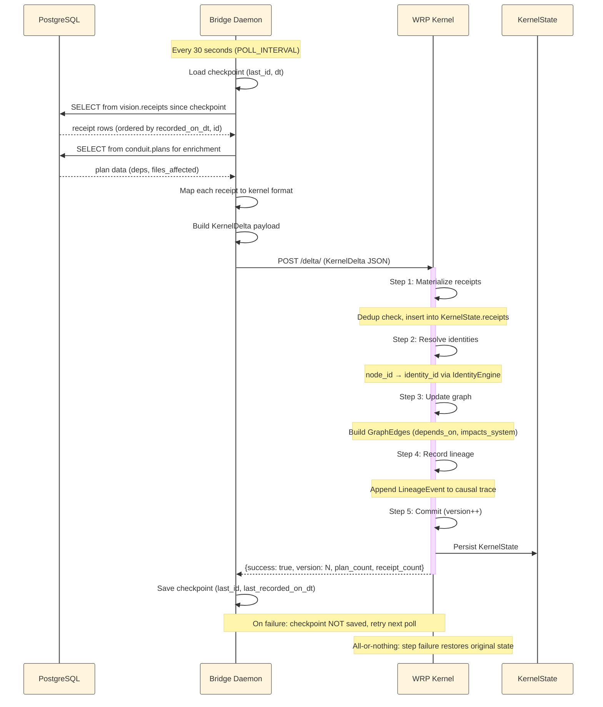

# WRP Pipeline Data Flow

> End-to-end data flow: vision receipts → bridge daemon → kernel delta → 5-step reduce → committed state.

## Data Flow Diagram

```mermaid
%%{init: {'theme': 'base', 'themeVariables': {
  'fontSize': '13px',
  'primaryBorderColor': '#555',
  'lineColor': '#666'
}}}%%

graph TB
    %% ===== STYLES =====
    classDef source fill:#0c2233,stroke:#1a6b8a,stroke-width:2px,color:#ddd
    classDef daemon fill:#1a0a2e,stroke:#9b59b6,stroke-width:2px,color:#ddd
    classDef kernel fill:#2d1b4e,stroke:#c084fc,stroke-width:2px,color:#eee
    classDef reduce fill:#1e1e3f,stroke:#7c3aed,stroke-width:2px,color:#ddd
    classDef state fill:#3b0764,stroke:#a855f7,stroke-width:2px,color:#eee
    classDef data fill:#1b4332,stroke:#2d6a4f,stroke-width:2px,color:#ddd
    classDef error fill:#4a0000,stroke:#ff4444,stroke-width:2px,color:#ff8888
    classDef receipt fill:#16213e,stroke:#0f3460,stroke-width:2px,color:#ddd
    classDef plan fill:#4a1942,stroke:#7b2d8e,stroke-width:2px,color:#eee
    classDef external fill:#2d2d2d,stroke:#888,stroke-width:2px,color:#ccc

    %% ===== EDGE STYLES =====
    linkStyle default stroke-width:1.5px,fill:none

    %% ===== POLL CYCLE =====
    subgraph POLL["Poll Cycle (every 30s)"]
        direction TB
        CKPT["📋 Checkpoint (disk)<br/><small>last_id + last_recorded_on_dt</small>"]:::data
        QRY["🔍 Query vision.receipts<br/><small>WHERE (recorded_on_dt, id) > checkpoint<br/>ORDER BY recorded_on_dt ASC, id ASC<br/>LIMIT 500</small>"]:::daemon
        ENR["📎 Enrich from conduit.plans<br/><small>dependencies, files_affected</small>"]:::daemon
        MAP["🔄 Semantic Mapping<br/><small>Conduit receipt → Kernel receipt<br/>Critical BP: deterministic mapping</small>"]:::daemon
        BUILD["📦 Build KernelDelta<br/><small>delta_id, batch_id, receipts,<br/>affected_plans</small>"]:::daemon
        POST["📤 POST /delta/<br/><small>URL: {KERNEL_API_URL}/delta/</small>"]:::daemon
        SAVE["💾 Save Checkpoint<br/><small>response.success=True → save<br/>response.success=False → retry</small>"]:::daemon
    end

    %% ===== POSTGRESQL DATA SOURCES =====
    subgraph PG["PostgreSQL Sources (:5432)"]
        direction TB
        VISION("vision.receipts<br/><small>Source of truth for receipt events</small>"):::source
        PLANS("conduit.plans<br/><small>Plan enrichment data<br/>deps + files_affected</small>"):::source
        STATE("WRP Kernel State<br/><small>Checkpointed after each commit</small>"):::state
    end

    %% ===== KERNEL REDUCE PIPELINE =====
    subgraph REDUCE["WRP Kernel — 5-Step Reduce Pipeline"]
        direction TB

        STEP1["1️⃣ Receipt Materialization<br/><small>KernelEngine._materialize()</small>"]:::reduce
        STEP1_DETAIL["<small>• Insert receipts into KernelState.receipts<br/>• Dedup: reject duplicate receipt_id<br/>• Track affected_plans in KernelState.plans</small>"]:::receipt

        STEP2["2️⃣ Identity Resolution<br/><small>KernelEngine._resolve_identities()<br/>IdentityEngine.resolve()</small>"]:::reduce
        STEP2_DETAIL["<small>• Resolve node_id → identity_id<br/>• Creates Identity(aliases={node_id})<br/>• identity_id = f\"iden::{node_id}\"<br/>• Ensures cross-plan continuity</small>"]:::receipt

        STEP3["3️⃣ Graph Update<br/><small>KernelEngine._update_graph()</small>"]:::reduce
        STEP3_DETAIL["<small>• Build GraphEdges from dependencies<br/>→ wrp:depends_on edges<br/>• Build GraphEdges from files_affected<br/>→ wrp:impacts_system edges<br/>• Identity-based adjacency list</small>"]:::receipt

        STEP4["4️⃣ Lineage Recording<br/><small>KernelEngine._record_lineage()<br/>LineageEngine.record_from_delta()</small>"]:::reduce
        STEP4_DETAIL["<small>• Append LineageEvent to trace<br/>• version, delta_id, step, event_type<br/>• Append-only causal event log</small>"]:::receipt

        STEP5["5️⃣ Commit<br/><small>KernelEngine.reduce() final step</small>"]:::reduce
        STEP5_DETAIL["<small>• increment KernelState.version++<br/>• All-or-nothing: any prior step failure<br/>  restores original state snapshot<br/>• Returns KernelResult(value|error)</small>"]:::state
    end

    %% ===== WRP STATE MACHINE =====
    subgraph SM["WRP State Machine — Receipt → WRP State Mapping"]
        direction LR
        MAPPING["Receipt Types → WRP States"]:::plan
        MAP_TABLE["<small>
PROPOSED      → CREATED
PLAN_CREATE   → PLANNING
CRITIQUE      → CRITIQUE
CRITIQUE_PASS → SPECIFICATION
CRITIQUE_REJECT → PLANNING
IMPLEMENTATION  → EXECUTING
REVIEW        → APPROVED
REVIEW_PASS   → COMPLETED
REVIEW_REJECT → EXECUTING
BLOCK/API_LIMIT → FAILED
REQUEUED      → QUEUED
CANCELLED     → ARCHIVED
ABANDONED     → FAILED
        </small>"]:::receipt
    end

    %% ===== ERROR / ROLLBACK =====
    subgraph ERR["Error Handling"]
        direction TB
        ERR_TYPES["KernelError types"]:::error
        ERR_LIST["<small>
• INVARIANT_VIOLATION — state machine invariant broken
• IDENTITY_CONFLICT — identity resolution ambiguity
• GRAPH_CYCLE — cycle detected
• VERSION_MISMATCH — optimistic concurrency
• INVALID_TRANSITION — transition not in adjacency matrix
• VALIDATION_ERROR — KernelDelta validation failure
        </small>"]:::error
        ROLLBACK["<small>All-or-nothing: any step failure →<br/>restore original KernelState snapshot<br/>Errors are LineageEvents, not exceptions</small>"]:::state
    end

    %% ===== KSRA =====
    subgraph KSRA["Kernel Snapshot Reconstruction Algorithm"]
        direction TB
        KSRA_FORMULA["KernelState(N) = Snapshot(K) + Replay(deltas K+1 → N)"]:::state
        KSRA_DETAIL["<small>
• K = closest valid snapshot version ≤ N
• Replay filters deltas > snapshot version
• Errors during reconstruction log + continue
• Partial insight still valid per KSRA policy
        </small>"]:::state
    end

    %% ===== DATA FLOW EDGES =====
    CKPT -->|"load last_id, dt"| QRY
    QRY -->|"receipt rows"| ENR
    ENR -->|"enriched receipts"| MAP
    MAP -->|"kernel-format receipts"| BUILD
    BUILD -->|"KernelDelta JSON"| POST
    POST -->|"success=true"| SAVE
    POST -->|"KernelDelta"| STEP1

    %% PG connections
    QRY -.->|"SELECT"| VISION
    ENR -.->|"SELECT"| PLANS
    SAVE -.->|"UPDATE checkpoint"| CKPT

    %% Reduce pipeline flow
    STEP1 --> STEP1_DETAIL
    STEP1_DETAIL --> STEP2
    STEP2 --> STEP2_DETAIL
    STEP2_DETAIL --> STEP3
    STEP3 --> STEP3_DETAIL
    STEP3_DETAIL --> STEP4
    STEP4 --> STEP4_DETAIL
    STEP4_DETAIL --> STEP5
    STEP5 --> STEP5_DETAIL
    STEP5_DETAIL -.->|"Snapshot"| STATE

    %% State machine
    STEP1_DETAIL -.->|"Receipt type maps to WRP state"| MAP_TABLE

    %% Error paths
    STEP1 -.->|"reject duplicate"| ERR_TYPES
    STEP2 -.->|"resolution failure"| ERR_TYPES
    STEP3 -.->|"cycle detection"| ERR_TYPES
    STEP5 -.->|"invariant broken"| ERR_TYPES
    ROLLBACK -.->|"restores"| STATE

    %% KSRA
    STATE -.->|"snapshot for reconstruction"| KSRA_FORMULA
    SAVE -.->|"new receipts"| KSRA_FORMULA
```

## Timing & Sequence Diagram



## Receipt → Kernel State Lifecycle

```mermaid
%%{init: {'theme': 'base', 'themeVariables': {
  'fontSize': '12px',
  'primaryBorderColor': '#555'
}}}%%

stateDiagram-v2
    [*] --> POLLING: Daemon starts

    state POLLING {
        [*] --> QUERY: Load checkpoint
        QUERY --> ENRICH: Receipts found
        QUERY --> [*]: No new receipts
        ENRICH --> MAP: Plan data fetched
        MAP --> BUILD: Kernel-format receipts
        BUILD --> POST: KernelDelta ready
    }

    POST --> ACCEPTED: Kernel accepts (success=true)
    POST --> RETRY: Kernel rejects (success=false)

    ACCEPTED --> COMMIT: 5-Step Reduce
    ACCEPTED --> CHECKPOINT: Save position

    state COMMIT {
        [*] --> MATERIALIZE
        MATERIALIZE --> IDENTITY: Step 1 OK
        MATERIALIZE --> FAILED: Duplicate receipt
        IDENTITY --> GRAPH: Step 2 OK
        IDENTITY --> FAILED: Resolution ambiguity
        GRAPH --> LINEAGE: Step 3 OK
        GRAPH --> FAILED: Cycle detected
        LINEAGE --> COMMIT_STEP: Step 4 OK
        COMMIT_STEP --> [*]: Version incremented
        COMMIT_STEP --> FAILED: Invariant violated
    }

    FAILED --> ROLLBACK: Restore original state
    ROLLBACK --> POLLING: Next cycle
    
    CHECKPOINT --> POLLING: sleep(interval)

    retry RETRY --> POLLING: 30s wait (delta not saved)

    state RECONSTRUCTION {
        [*] --> SNAPSHOT_LOAD
        SNAPSHOT_LOAD --> REPLAY: Replay deltas > snapshot
        REPLAY --> [*]: Done
    }

    FAILED -.-> RECONSTRUCTION: Partial insight preserved
```

---

## Key Data Structures

### KernelDelta
```
{
  delta_id:        string           # "bridge-sync-{id1}-{id2}-{timestamp}"
  batch_id:        string           # Logical batch grouping
  receipts:        Receipt[]        # Kernel-compatible receipt objects
  affected_plans:  string[]         # Set of plan IDs touched
  invalidated_plans: string[]       # Plans whose cache is stale
  version:         int              # Monotonic version (0 when created)
}
```

### KernelState
```
{
  version:     int                  # Monotonic version counter
  receipts:   Dict[id → Receipt]   # All processed receipts
  plans:      Set[plan_id]         # Known plan IDs
  transitions: List[Transition]    # Applied WRP state transitions
  graph:      GraphIndex           # Identity-based adjacency list
  identity:   IdentityEngine       # node_id → identity_id mappings
  lineage:    LineageEngine        # Append-only causal event log
  metadata:   Dict?                # Optional metadata
}
```

### WRP Adjacency Matrix
```
CREATED       → [INTAKE, FAILED]
INTAKE        → [PLANNING, FAILED]
PLANNING      → [CRITIQUE, FAILED]
CRITIQUE      → [PLANNING, SPECIFICATION, FAILED]
SPECIFICATION → [CRITIQUE, APPROVED, FAILED]
APPROVED      → [SPECIFICATION, QUEUED, FAILED]
QUEUED        → [EXECUTING, FAILED]
EXECUTING     → [COMPLETED, FAILED]
COMPLETED     → [ARCHIVED, FAILED]
ARCHIVED      → []
FAILED        → []
```

---

*Sources: `python/conduit/bridge/daemon.py`, `python/conduit/bridge/sync.py`, `python/conduit/bridge/checkpoint.py`, `python/conduit/wrp_kernel/engine.py`, `python/conduit/wrp_kernel/delta.py`, `python/conduit/wrp_kernel/identity.py`, `python/conduit/wrp_kernel/graph.py`, `python/conduit/wrp_kernel/lineage.py`.*
